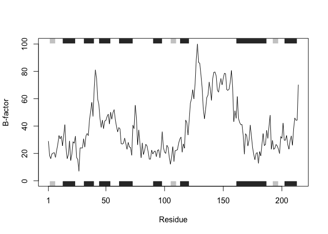

# Homework 6
Christeena Pano (PID: A7842497)

``` r
library(bio3d) 
```

## Comments from rubric

> *Inputs to the function*: The protein ID from the Protein Data Bank
> (PDB)

> *What the function does and how to use it*: This function uses the
> protein ID to analyze proteins by trimming them to a specific chain
> (A) and atom/element type (CA), and reading their b-factor values.
> This is used to generate a plot from any PDB ID, with the specific
> characteristics wanted. This function is used by using the function
> `pdb.plot` and using the `PDB ID` as the input.

> *Output of the function*: The output of the function is a b-factor
> plot as well as the b-factor data in the form of a vector.

``` r
pdb.plot <- function(pdb_id) {

  structure <- read.pdb(pdb_id)
  
  structure.trim <- trim.pdb(structure, chain = "A", elety = "CA")
  
  b <- structure.trim$atom$b
  
  plotb3(b, sse = structure.trim, typ = "l", ylab = "B-factor")
  
  return(b)
}
```

## Function works and correct output is produced

``` r
pdb.plot("4AKE")
```

      Note: Accessing on-line PDB file



      [1]  29.02  18.44  16.20  19.67  20.26  20.55  17.05  22.13  26.71  33.05
     [11]  30.66  32.73  25.61  33.19  41.03  24.09  16.18  19.14  29.19  14.79
     [21]  19.63  28.54  27.49  32.56  17.13  15.50   6.98  24.07  24.00  23.94
     [31]  30.70  24.70  32.84  34.60  33.01  44.60  50.74  57.32  47.04  67.13
     [41]  81.04  75.20  59.68  55.63  45.12  39.04  44.31  38.21  43.70  44.19
     [51]  47.00  48.67  41.54  50.22  45.07  49.77  52.04  44.82  39.75  35.79
     [61]  38.92  37.93  27.18  26.86  27.53  31.16  27.08  23.03  28.12  24.78
     [71]  24.22  18.69  40.67  38.08  55.26  46.29  26.25  37.14  27.50  16.86
     [81]  27.76  19.27  22.22  26.70  25.52  21.22  15.90  15.84  22.44  19.61
     [91]  21.23  21.79  17.64  22.19  22.73  16.80  23.25  35.95  24.42  20.96
    [101]  20.00  25.99  24.39  17.19  12.16  17.35  24.97  14.08  22.01  22.26
    [111]  22.78  27.47  30.49  32.02  20.90  27.03  23.84  44.37  42.47  33.48
    [121]  44.56  56.67  60.18  66.62  59.95  70.81  88.63 100.11  86.60  85.80
    [131]  77.48  68.13  52.66  45.34  52.43  60.90  62.64  72.19  66.75  58.73
    [141]  74.57  79.29  79.53  76.58  66.40  64.76  70.48  74.84  70.11  74.82
    [151]  78.61  78.24  66.70  66.10  67.01  72.28  80.64  68.54  43.23  51.24
    [161]  45.72  61.60  45.61  42.57  41.03  41.02  33.34  19.48  34.38  33.11
    [171]  25.48  29.68  40.71  32.91  24.41  19.20  15.43  19.93  20.66  12.72
    [181]  21.40  18.21  26.68  34.50  25.77  26.52  36.85  31.05  39.84  48.03
    [191]  23.04  29.57  23.00  23.80  26.59  25.49  23.25  19.89  32.37  30.97
    [201]  42.16  29.64  29.69  33.15  26.38  23.17  29.35  32.80  25.92  38.01
    [211]  45.95  44.26  44.35  70.26
