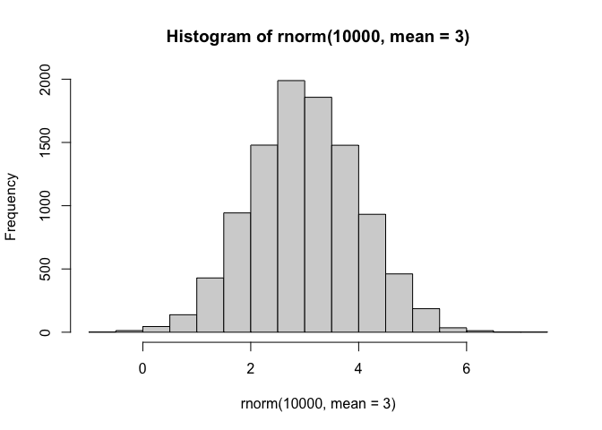
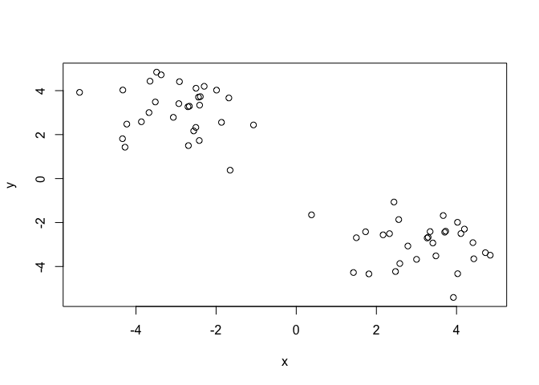
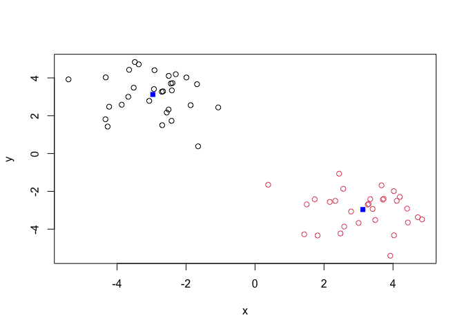
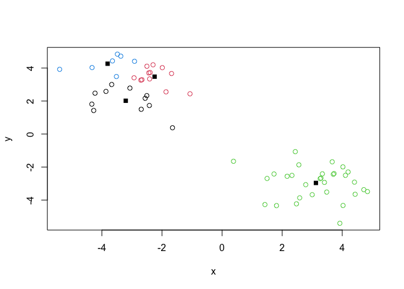
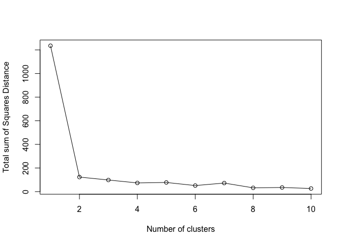
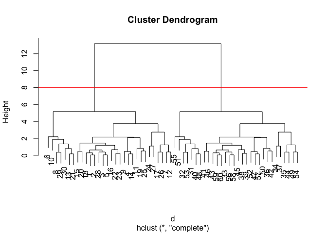
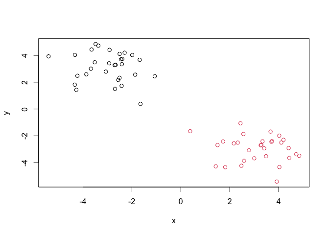
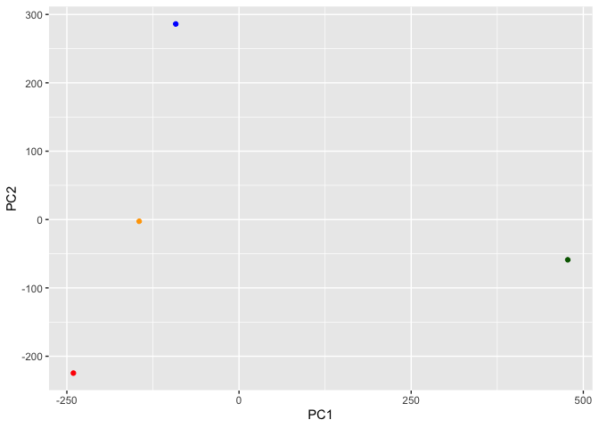
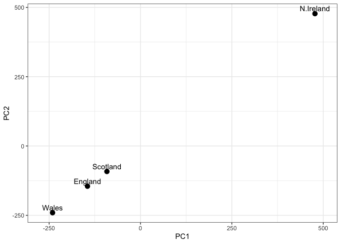
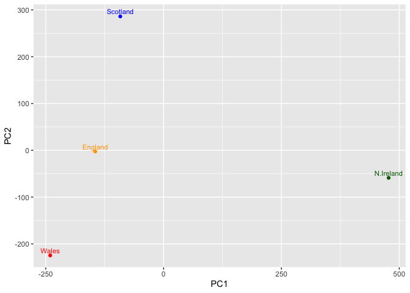

# Class 7: Machine Learning 1
Christeena Pano (PID: A17842497)

- [Background](#background)
- [K-means clustering](#k-means-clustering)
- [Hierarchical Clustering](#hierarchical-clustering)
- [Analysis of UK food data](#analysis-of-uk-food-data)
- [Data Import](#data-import)
- [Tidy data](#tidy-data)
- [Exporatory analysis](#exporatory-analysis)
- [Pair Plots and Heatmaps](#pair-plots-and-heatmaps)
- [PCA to the rescue](#pca-to-the-rescue)

## Background

Today we will explore some core machine learning methods that are very
popular in bioinformatics. The include **clustering** and
**dimenstionallity reduction**.

## K-means clustering

the main function in “base” R for K-means clustering is called
`kmeans()`

Before we go too deep let’s make up some “simple” data that we can
cluster and know if we are getting a good answer or not. To do this we
can use the `rnorm()` function:

``` r
# Gnerate 10000 random numbers with a normal distrubtion 

# Plot as histogram

hist( rnorm(10000, mean=3) )
```



``` r
# Generate 30 random numbers in 2 groups with  normal distributions centered at -3 and 3
x <- c( rnorm(30, -3), rnorm(30, +3) )

# Combine vectors as column using cbind() where y is the reverse of x, and assign to "z" 

z <- cbind(x=x, y=rev(x))

# Plot "z" 
plot(z)
```



Now we can run `kmeans()` on this input `z` and see what the results
look like.

``` r
# Generate k-means clustering with "z" using 2 centers
km <- kmeans(z, centers = 2)
km
```

    K-means clustering with 2 clusters of sizes 30, 30

    Cluster means:
              x         y
    1 -2.963111  3.125384
    2  3.125384 -2.963111

    Clustering vector:
     [1] 1 1 1 1 1 1 1 1 1 1 1 1 1 1 1 1 1 1 1 1 1 1 1 1 1 1 1 1 1 1 2 2 2 2 2 2 2 2
    [39] 2 2 2 2 2 2 2 2 2 2 2 2 2 2 2 2 2 2 2 2 2 2

    Within cluster sum of squares by cluster:
    [1] 61.58238 61.58238
     (between_SS / total_SS =  90.0 %)

    Available components:

    [1] "cluster"      "centers"      "totss"        "withinss"     "tot.withinss"
    [6] "betweenss"    "size"         "iter"         "ifault"      

``` r
# Display the attributes of the k-means clustering results
attributes(km)
```

    $names
    [1] "cluster"      "centers"      "totss"        "withinss"     "tot.withinss"
    [6] "betweenss"    "size"         "iter"         "ifault"      

    $class
    [1] "kmeans"

> **Q**. How many points are in each cluster?

30 points in each cluster

``` r
# Find the number of points/size in each cluster
km$size
```

    [1] 30 30

> **Q**. What component of your result object details cluster
> assignment/membership?

``` r
km$cluster
```

     [1] 1 1 1 1 1 1 1 1 1 1 1 1 1 1 1 1 1 1 1 1 1 1 1 1 1 1 1 1 1 1 2 2 2 2 2 2 2 2
    [39] 2 2 2 2 2 2 2 2 2 2 2 2 2 2 2 2 2 2 2 2 2 2

> **Q**. What “component of your result object details cluster center?

``` r
km$centers
```

              x         y
    1 -2.963111  3.125384
    2  3.125384 -2.963111

> **Q**. Plot `z` colored by the kmeans cluster assignment and add
> cluster centers as blue points

``` r
plot(z, col=km$cluster)
points(km$centers, col="blue", pch=15)
```



> **Q**. Run a K-means clustering and plot the results asking for 4
> clusters (K=4)?

``` r
km4 <- kmeans(z, centers = 4)
plot(z, col=km4$cluster)
points(km4$centers, col = "black", pch=15)
```



> **N.B** You need to tell K-means the number of clusters (i.e. set
> `centers=2`)!!

One approach is to try different values for `centers` and then pick the
best…

``` r
ans <- NULL 
for(i in 1:10) {
  km <- kmeans(z, centers=i)
  ans <- c(ans, km$tot.withinss)
  }

plot(ans, typ="o", 
     xlab = "Number of clusters", 
     ylab="Total sum of Squares Distance")
```



## Hierarchical Clustering

The main function in “base” R for Hierarchical Clustering is called
`hclust()`

This function does not take your “raw” data for clustering. You must
first build a “distance matrix” from your data and pass this as input to
`hclust()`

``` r
d <- dist(z)
hc <- hclust(d)
hc
```


    Call:
    hclust(d = d)

    Cluster method   : complete 
    Distance         : euclidean 
    Number of objects: 60 

There is a bespoke `plot()` method for `hclust()` result objects.

``` r
plot(hc)
abline(h=8,col="red")
```



Once we have our `hclust()` object (our “tree” of “cluster dendrogram”)
we can *“cut”* the tree to reveal the clustering pattern.

``` r
cutree(hc, h=4)
```

     [1] 1 1 1 1 1 2 1 2 1 2 1 1 2 1 1 1 1 1 1 1 2 1 1 1 1 1 1 1 2 2 3 3 4 4 4 4 4 4
    [39] 4 3 4 4 4 4 4 4 4 3 4 4 3 4 3 4 3 4 4 4 4 4

> Q. Make a plot of `z` with your hclust results (i. e. colored by
> cluster membership)

``` r
grps <- cutree(hc, k=2)
plot(z, col = grps)
```



\##Principal Component Analysis (PCA)

PCA is a dimensionality reduction method that is popular for revealing
patterns in complex datasets.

## Analysis of UK food data

Let’s look at some data on the eating habits of folks from the UK to see
if there are patterns and trends that have some regions being distinct
from others.

## Data Import

The data is made available in CSV format so we can use the `read.csv()`
function for import to R

``` r
# Import data
url <- "https://tinyurl.com/UK-foods"
x <- read.csv(url)
x
```

                         X England Wales Scotland N.Ireland
    1               Cheese     105   103      103        66
    2        Carcass_meat      245   227      242       267
    3          Other_meat      685   803      750       586
    4                 Fish     147   160      122        93
    5       Fats_and_oils      193   235      184       209
    6               Sugars     156   175      147       139
    7      Fresh_potatoes      720   874      566      1033
    8           Fresh_Veg      253   265      171       143
    9           Other_Veg      488   570      418       355
    10 Processed_potatoes      198   203      220       187
    11      Processed_Veg      360   365      337       334
    12        Fresh_fruit     1102  1137      957       674
    13            Cereals     1472  1582     1462      1494
    14           Beverages      57    73       53        47
    15        Soft_drinks     1374  1256     1572      1506
    16   Alcoholic_drinks      375   475      458       135
    17      Confectionery       54    64       62        41

> **Q1**. How many rows and columns are in your new data frame named x?
> What R functions could you use to answer this questions?

There are 17 rows and 5 columns. You can use `dim()`, which returns the
number of rows and columns or `nrow()` and `ncol()` to return each
separately

``` r
#use `dim()` to return the number of rows and columns
dim(x)
```

    [1] 17  5

## Tidy data

Fix anything that went wrong with data import

``` r
# Note how the minus indexing works
rownames(x) <- x[,1]
x <- x[,-1]
head(x)
```

                   England Wales Scotland N.Ireland
    Cheese             105   103      103        66
    Carcass_meat       245   227      242       267
    Other_meat         685   803      750       586
    Fish               147   160      122        93
    Fats_and_oils      193   235      184       209
    Sugars             156   175      147       139

``` r
dim(x)
```

    [1] 17  4

``` r
# Fix data to be 4 columns as expected 

# Read the data file again and set row.names argument of read.csv() to be column 1
x <- read.csv(url, row.names=1)
head(x)
```

                   England Wales Scotland N.Ireland
    Cheese             105   103      103        66
    Carcass_meat       245   227      242       267
    Other_meat         685   803      750       586
    Fish               147   160      122        93
    Fats_and_oils      193   235      184       209
    Sugars             156   175      147       139

``` r
dim(x)
```

    [1] 17  4

> **Q2**. Which approach to solving the ‘row-names problem’ mentioned
> above do you prefer and why? Is one approach more robust than another
> under certain circumstance?

I prefer to solve the ‘row-names problem’ using the second approach. The
first one alters the data continually by removing an additional column
everytime it is run. The second approach keeps the data consistent and
correct.

## Exporatory analysis

Make some plots to help make sense of obvious trends…

``` r
# Using base R
barplot(as.matrix(x), beside=T, col=rainbow(nrow(x)))
```


> **Q3**: Changing what optional argument in the above `barplot()`
> function results in the following plot?

Setting beside=FALSE

``` r
# Set beside to FALSE to make new barplot
barplot(as.matrix(x), beside=F, col=rainbow(nrow(x)))
```


``` r
# Install ggplot2 
              
# Create grouped bar plot
library(ggplot2)
```

``` r
library(tidyr)

# Convert data to long format for ggplot with `pivot_longer()`
x_long <- x |> 
          tibble::rownames_to_column("Food") |> 
          pivot_longer(cols = -Food, 
                       names_to = "Country", 
                       values_to = "Consumption")
```

``` r
# Create bar graph of food consumption by country 
ggplot(x_long) +
  aes(x = Country, y = Consumption, fill = Food) +
  geom_col(position = "dodge") +
  theme_bw()
```


> **Q4**: Changing what optional argument in the above ggplot() code
> results in a stacked barplot figure?

Changing the geom_col() argument from “dodge” to “stack” results in a
stacked barplot figure.

``` r
# Create bar graph of food consumption by country 
ggplot(x_long) +
  aes(x = Country, y = Consumption, fill = Food) +
  geom_col(position = "stack") +
  theme_bw()
```


``` r
# install.packages("tidyr")
```

``` r
library(tidyr)

# Convert data to long format for ggplot with `pivot_longer()`
x_long <- x |> 
          tibble::rownames_to_column("Food") |> 
          pivot_longer(cols = -Food, 
                       names_to = "Country", 
                       values_to = "Consumption")
```

``` r
dim(x_long)
```

    [1] 68  3

``` r
head(x_long)
```

    # A tibble: 6 × 3
      Food            Country   Consumption
      <chr>           <chr>           <int>
    1 "Cheese"        England           105
    2 "Cheese"        Wales             103
    3 "Cheese"        Scotland          103
    4 "Cheese"        N.Ireland          66
    5 "Carcass_meat " England           245
    6 "Carcass_meat " Wales             227

## Pair Plots and Heatmaps

> **Q5**: We can use the pairs() function to generate all pairwise plots
> for our countries. Can you make sense of the following code and
> resulting figure? What does it mean if a given point lies on the
> diagonal for a given plot?

The resulting figure is a plot that shows each country against each
country with each colored dot representing a food category. If a given
point lies on the diagonal for a given plot, it means that two countries
consume the same amount of a particular food group. The further away
from the diaganol a given point is, the more different those two
countries in that plot are in terms of that specific food group
consumption amount.

``` r
# use the pairs() function to generate all pairwise plots for the countries
pairs(x, col=rainbow(nrow(x)), pch=16)
```


``` r
#install.packages("pheatmap")
```

``` r
library(pheatmap)

# Generate heatmap to represent data as colors
pheatmap( as.matrix(x) )
```


> **Q6**. Based on the pairs and heatmap figures, which countries
> cluster together and what does this suggest about their food
> consumption patterns? Can you easily tell what the main differences
> between N. Ireland and the other countries of the UK in terms of this
> data-set?

Wales and England seem to cluster together the most according to the
heatmap figure. However, even Scotland is very similar to them, with the
only apparent country differing slightly being N. Ireland. This suggests
that England and Wales, and even Scotland consume very similar amounts
of the same food groups as their colors are similar for the same food
groups. N. Ireland has a visible difference in color for fresh fruti and
other meat as it consumes much less of these groups and much more fresh
potatoes.

> **Key point**: Even relatively small datasets can prove challenging to
> interpret

## PCA to the rescue

The main function in “base” R for PCA is called `prcomp()`.This function
wants the “observation” to be rows and the “variables” to columns.

So here we need to take the transpose of our `x` input object

``` r
# Use the prcomp() PCA function 
pca <- prcomp( t(x) )
summary(pca)
```

    Importance of components:
                                PC1      PC2      PC3       PC4
    Standard deviation     324.1502 212.7478 73.87622 2.921e-14
    Proportion of Variance   0.6744   0.2905  0.03503 0.000e+00
    Cumulative Proportion    0.6744   0.9650  1.00000 1.000e+00

The returned `pca` object has components that we can use to make our
main result figures:

``` r
attributes(pca)
```

    $names
    [1] "sdev"     "rotation" "center"   "scale"    "x"       

    $class
    [1] "prcomp"

The main result figure from this analysis is called a **“PC score
plot”** (a.k.a. an “ordination plot” “PC plot” or simply “PC1 vs. PC2
plot.”)

This plot shows how samples (in this case countries)

``` r
library(ggplot2)

# Create PC score plot
ggplot(pca$x) + 
  aes(PC1, PC2) +
  geom_point()
```


``` r
mycols <- c("orange", "red", "blue", "darkgreen")

ggplot(pca$x)+
  aes(PC1, PC2) +
  geom_point(col=mycols)
```



> **Q7**. Complete the code below to generate a plot of PC1 vs PC2. The
> second line adds text labels over the data points.

``` r
# Create a data frame for plotting
df <- as.data.frame(pca$x)
df$Country <- rownames(df)

# Plot PC1 vs PC2 with ggplot
ggplot(pca$x) +
  aes(x = PC1, y = PC1, label = rownames(pca$x)) +
  geom_point(size = 3) +
  geom_text(vjust = -0.5) +
  xlim(-270, 500) +
  xlab("PC1") +
  ylab("PC2") +
  theme_bw()
```



> **Q8**. Customize your plot so that the colors of the country names
> match the colors in our UK and Ireland map and table at start of this
> document.

``` r
# Customize ggplot so the colors of country names match colors in UK and Ireland map and table
ggplot(pca$x)+
  aes(PC1, PC2, label=row.names(pca$x)) +
  geom_point(col=mycols) +
  geom_text(size=3, vjust=-0.5, col=mycols)
```



``` r
v <- round( pca$sdev^2/sum(pca$sdev^2) * 100 )
v
```

    [1] 67 29  4  0

``` r
## or the second row here...
z <- summary(pca)
z$importance
```

                                 PC1       PC2      PC3          PC4
    Standard deviation     324.15019 212.74780 73.87622 2.921348e-14
    Proportion of Variance   0.67444   0.29052  0.03503 0.000000e+00
    Cumulative Proportion    0.67444   0.96497  1.00000 1.000000e+00

``` r
# Create scree plot with ggplot
variance_df <- data.frame(
  PC = factor(paste0("PC", 1:length(v)), levels = paste0("PC", 1:length(v))),
  Variance = v
)

ggplot(variance_df) +
  aes(x = PC, y = Variance) +
  geom_col(fill = "steelblue") +
  xlab("Principal Component") +
  ylab("Percent Variation") +
  theme_bw() +
  theme(axis.text.x = element_text(angle = 0))
```


``` r
## Lets focus on PC1 as it accounts for > 90% of variance 
ggplot(pca$rotation) +
  aes(x = PC1, 
      y = reorder(rownames(pca$rotation), PC1)) +
  geom_col(fill = "steelblue") +
  xlab("PC1 Loading Score") +
  ylab("") +
  theme_bw() +
  theme(axis.text.y = element_text(size = 9))
```


> **Q9**: Generate a similar ‘loadings plot’ for PC2. What two food
> groups feature prominentely and what does PC2 mainly tell us about?

``` r
## Lets focus on PC2 as it accounts for > 90% of variance 
ggplot(pca$rotation) +
  aes(x = PC2, 
      y = reorder(rownames(pca$rotation), PC2)) +
  geom_col(fill = "steelblue") +
  xlab("PC2 Loading Score") +
  ylab("") +
  theme_bw() +
  theme(axis.text.y = element_text(size = 9))
```


The two food groups that feature prominently are fresh potatoes and soft
drinks. Fresh potatoes have the highest negative score while soft drinks
have the highest positive loading score. PC2 tells us about the
difference between consumption of the different countries in regards to
fresh potatoes and soft drinks. Since PC1 captures the largest variance
which was N. Ireland’s differences in consumption, PC2 now captures the
variance between fresh potato and soft drink consumption between the
countries.
