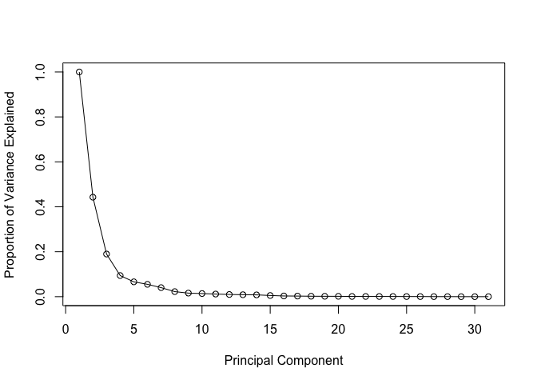
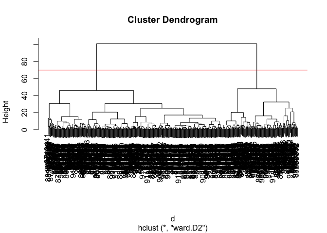
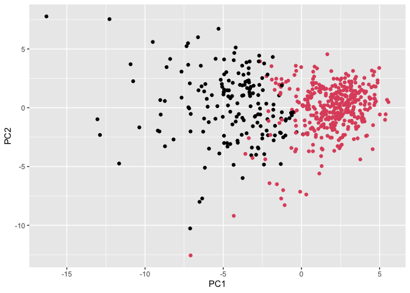
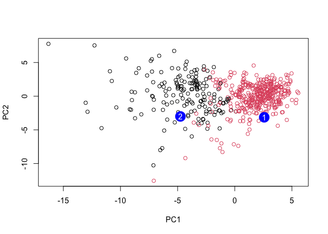

# Class 8: Mini Project
Christeena pano (PID: A17842497)

- [Exploratory Data Analysis](#exploratory-data-analysis)
- [Principal Component Analysis
  (PCA)](#principal-component-analysis-pca)
- [Hierarchical Clustering](#hierarchical-clustering)
- [Combining methods](#combining-methods)
- [Prediction](#prediction)

``` r
## Save your input data file into your Project directory
fna.data <- "WisconsinCancer.csv"

# Complete the following code to input the data and store as wisc.df
wisc.df <- read.csv(fna.data, row.names=1)
head(wisc.df)
```

             diagnosis radius_mean texture_mean perimeter_mean area_mean
    842302           M       17.99        10.38         122.80    1001.0
    842517           M       20.57        17.77         132.90    1326.0
    84300903         M       19.69        21.25         130.00    1203.0
    84348301         M       11.42        20.38          77.58     386.1
    84358402         M       20.29        14.34         135.10    1297.0
    843786           M       12.45        15.70          82.57     477.1
             smoothness_mean compactness_mean concavity_mean concave.points_mean
    842302           0.11840          0.27760         0.3001             0.14710
    842517           0.08474          0.07864         0.0869             0.07017
    84300903         0.10960          0.15990         0.1974             0.12790
    84348301         0.14250          0.28390         0.2414             0.10520
    84358402         0.10030          0.13280         0.1980             0.10430
    843786           0.12780          0.17000         0.1578             0.08089
             symmetry_mean fractal_dimension_mean radius_se texture_se perimeter_se
    842302          0.2419                0.07871    1.0950     0.9053        8.589
    842517          0.1812                0.05667    0.5435     0.7339        3.398
    84300903        0.2069                0.05999    0.7456     0.7869        4.585
    84348301        0.2597                0.09744    0.4956     1.1560        3.445
    84358402        0.1809                0.05883    0.7572     0.7813        5.438
    843786          0.2087                0.07613    0.3345     0.8902        2.217
             area_se smoothness_se compactness_se concavity_se concave.points_se
    842302    153.40      0.006399        0.04904      0.05373           0.01587
    842517     74.08      0.005225        0.01308      0.01860           0.01340
    84300903   94.03      0.006150        0.04006      0.03832           0.02058
    84348301   27.23      0.009110        0.07458      0.05661           0.01867
    84358402   94.44      0.011490        0.02461      0.05688           0.01885
    843786     27.19      0.007510        0.03345      0.03672           0.01137
             symmetry_se fractal_dimension_se radius_worst texture_worst
    842302       0.03003             0.006193        25.38         17.33
    842517       0.01389             0.003532        24.99         23.41
    84300903     0.02250             0.004571        23.57         25.53
    84348301     0.05963             0.009208        14.91         26.50
    84358402     0.01756             0.005115        22.54         16.67
    843786       0.02165             0.005082        15.47         23.75
             perimeter_worst area_worst smoothness_worst compactness_worst
    842302            184.60     2019.0           0.1622            0.6656
    842517            158.80     1956.0           0.1238            0.1866
    84300903          152.50     1709.0           0.1444            0.4245
    84348301           98.87      567.7           0.2098            0.8663
    84358402          152.20     1575.0           0.1374            0.2050
    843786            103.40      741.6           0.1791            0.5249
             concavity_worst concave.points_worst symmetry_worst
    842302            0.7119               0.2654         0.4601
    842517            0.2416               0.1860         0.2750
    84300903          0.4504               0.2430         0.3613
    84348301          0.6869               0.2575         0.6638
    84358402          0.4000               0.1625         0.2364
    843786            0.5355               0.1741         0.3985
             fractal_dimension_worst
    842302                   0.11890
    842517                   0.08902
    84300903                 0.08758
    84348301                 0.17300
    84358402                 0.07678
    843786                   0.12440

``` r
head(wisc.df, 3)
```

             diagnosis radius_mean texture_mean perimeter_mean area_mean
    842302           M       17.99        10.38          122.8      1001
    842517           M       20.57        17.77          132.9      1326
    84300903         M       19.69        21.25          130.0      1203
             smoothness_mean compactness_mean concavity_mean concave.points_mean
    842302           0.11840          0.27760         0.3001             0.14710
    842517           0.08474          0.07864         0.0869             0.07017
    84300903         0.10960          0.15990         0.1974             0.12790
             symmetry_mean fractal_dimension_mean radius_se texture_se perimeter_se
    842302          0.2419                0.07871    1.0950     0.9053        8.589
    842517          0.1812                0.05667    0.5435     0.7339        3.398
    84300903        0.2069                0.05999    0.7456     0.7869        4.585
             area_se smoothness_se compactness_se concavity_se concave.points_se
    842302    153.40      0.006399        0.04904      0.05373           0.01587
    842517     74.08      0.005225        0.01308      0.01860           0.01340
    84300903   94.03      0.006150        0.04006      0.03832           0.02058
             symmetry_se fractal_dimension_se radius_worst texture_worst
    842302       0.03003             0.006193        25.38         17.33
    842517       0.01389             0.003532        24.99         23.41
    84300903     0.02250             0.004571        23.57         25.53
             perimeter_worst area_worst smoothness_worst compactness_worst
    842302             184.6       2019           0.1622            0.6656
    842517             158.8       1956           0.1238            0.1866
    84300903           152.5       1709           0.1444            0.4245
             concavity_worst concave.points_worst symmetry_worst
    842302            0.7119               0.2654         0.4601
    842517            0.2416               0.1860         0.2750
    84300903          0.4504               0.2430         0.3613
             fractal_dimension_worst
    842302                   0.11890
    842517                   0.08902
    84300903                 0.08758

Make sure we remove or exlcude the `diagnosis` column from the data-set
that we use for further analysis - this is the expert diangosis as
either M or B.

``` r
# We can use -1 here to remove the first column
wisc.data <- wisc.df[,-1] 

# Create diagnosis vector for later 
diagnosis <- as.factor(wisc.df$diagnosis) 
```

## Exploratory Data Analysis

> **Q1**. How many observations are in this dataset?

``` r
nrow(wisc.data)
```

    [1] 569

There are 569 observations in this data set.

> **Q2**. How many of the observations have a malignant diagnosis?

``` r
table(wisc.df$diagnosis)
```


      B   M 
    357 212 

212 observations have a malignant diagnosis.

> **Q3**. How many variables/features in the data are suffixed with
> `_mean`?

We can use the `grep()` function to help us here:

``` r
colnames(wisc.data)
```

     [1] "radius_mean"             "texture_mean"           
     [3] "perimeter_mean"          "area_mean"              
     [5] "smoothness_mean"         "compactness_mean"       
     [7] "concavity_mean"          "concave.points_mean"    
     [9] "symmetry_mean"           "fractal_dimension_mean" 
    [11] "radius_se"               "texture_se"             
    [13] "perimeter_se"            "area_se"                
    [15] "smoothness_se"           "compactness_se"         
    [17] "concavity_se"            "concave.points_se"      
    [19] "symmetry_se"             "fractal_dimension_se"   
    [21] "radius_worst"            "texture_worst"          
    [23] "perimeter_worst"         "area_worst"             
    [25] "smoothness_worst"        "compactness_worst"      
    [27] "concavity_worst"         "concave.points_worst"   
    [29] "symmetry_worst"          "fractal_dimension_worst"

``` r
#Search for column names with "_mean" using grep() and count the matches with length()
length( grep("_mean", colnames(wisc.data), value=T) )
```

    [1] 10

10 variables in the data are suffixed with `_mean`.

## Principal Component Analysis (PCA)

Performing PCA

``` r
# Check column means and standard deviations
colMeans(wisc.data)
```

                radius_mean            texture_mean          perimeter_mean 
               1.412729e+01            1.928965e+01            9.196903e+01 
                  area_mean         smoothness_mean        compactness_mean 
               6.548891e+02            9.636028e-02            1.043410e-01 
             concavity_mean     concave.points_mean           symmetry_mean 
               8.879932e-02            4.891915e-02            1.811619e-01 
     fractal_dimension_mean               radius_se              texture_se 
               6.279761e-02            4.051721e-01            1.216853e+00 
               perimeter_se                 area_se           smoothness_se 
               2.866059e+00            4.033708e+01            7.040979e-03 
             compactness_se            concavity_se       concave.points_se 
               2.547814e-02            3.189372e-02            1.179614e-02 
                symmetry_se    fractal_dimension_se            radius_worst 
               2.054230e-02            3.794904e-03            1.626919e+01 
              texture_worst         perimeter_worst              area_worst 
               2.567722e+01            1.072612e+02            8.805831e+02 
           smoothness_worst       compactness_worst         concavity_worst 
               1.323686e-01            2.542650e-01            2.721885e-01 
       concave.points_worst          symmetry_worst fractal_dimension_worst 
               1.146062e-01            2.900756e-01            8.394582e-02 

``` r
apply(wisc.data,2,sd)
```

                radius_mean            texture_mean          perimeter_mean 
               3.524049e+00            4.301036e+00            2.429898e+01 
                  area_mean         smoothness_mean        compactness_mean 
               3.519141e+02            1.406413e-02            5.281276e-02 
             concavity_mean     concave.points_mean           symmetry_mean 
               7.971981e-02            3.880284e-02            2.741428e-02 
     fractal_dimension_mean               radius_se              texture_se 
               7.060363e-03            2.773127e-01            5.516484e-01 
               perimeter_se                 area_se           smoothness_se 
               2.021855e+00            4.549101e+01            3.002518e-03 
             compactness_se            concavity_se       concave.points_se 
               1.790818e-02            3.018606e-02            6.170285e-03 
                symmetry_se    fractal_dimension_se            radius_worst 
               8.266372e-03            2.646071e-03            4.833242e+00 
              texture_worst         perimeter_worst              area_worst 
               6.146258e+00            3.360254e+01            5.693570e+02 
           smoothness_worst       compactness_worst         concavity_worst 
               2.283243e-02            1.573365e-01            2.086243e-01 
       concave.points_worst          symmetry_worst fractal_dimension_worst 
               6.573234e-02            6.186747e-02            1.806127e-02 

We need to scale our data before PCA with the `scale=TRUE` argument to
`prcomp()`

``` r
# Perform PCA on wisc.data by completing the following code
wisc.pr <- prcomp(wisc.data, scale=TRUE)

# Look at summary of results
summary(wisc.pr)
```

    Importance of components:
                              PC1    PC2     PC3     PC4     PC5     PC6     PC7
    Standard deviation     3.6444 2.3857 1.67867 1.40735 1.28403 1.09880 0.82172
    Proportion of Variance 0.4427 0.1897 0.09393 0.06602 0.05496 0.04025 0.02251
    Cumulative Proportion  0.4427 0.6324 0.72636 0.79239 0.84734 0.88759 0.91010
                               PC8    PC9    PC10   PC11    PC12    PC13    PC14
    Standard deviation     0.69037 0.6457 0.59219 0.5421 0.51104 0.49128 0.39624
    Proportion of Variance 0.01589 0.0139 0.01169 0.0098 0.00871 0.00805 0.00523
    Cumulative Proportion  0.92598 0.9399 0.95157 0.9614 0.97007 0.97812 0.98335
                              PC15    PC16    PC17    PC18    PC19    PC20   PC21
    Standard deviation     0.30681 0.28260 0.24372 0.22939 0.22244 0.17652 0.1731
    Proportion of Variance 0.00314 0.00266 0.00198 0.00175 0.00165 0.00104 0.0010
    Cumulative Proportion  0.98649 0.98915 0.99113 0.99288 0.99453 0.99557 0.9966
                              PC22    PC23   PC24    PC25    PC26    PC27    PC28
    Standard deviation     0.16565 0.15602 0.1344 0.12442 0.09043 0.08307 0.03987
    Proportion of Variance 0.00091 0.00081 0.0006 0.00052 0.00027 0.00023 0.00005
    Cumulative Proportion  0.99749 0.99830 0.9989 0.99942 0.99969 0.99992 0.99997
                              PC29    PC30
    Standard deviation     0.02736 0.01153
    Proportion of Variance 0.00002 0.00000
    Cumulative Proportion  1.00000 1.00000

> **Q4**. From your results, what proportion of the original variance is
> captured by the first principal component (PC1)?

The proportion of the original variance that is captured by PC1 is
0.4427.

> **Q5**. How many principal components (PCs) are required to describe
> at least 70% of the original variance in the data?

3 Pcs are required to describe at least 70% of the original variance in
the data.

> **Q6**. How many principal components (PCs) are required to describe
> at least 90% of the original variance in the data?

7 Pcs are required to describe at least 90% of the original variance in
the data.

Intepreting PCA Results

``` r
# Generate a biplot of the PCA results showing the observations and original variables along PC1 and PC2
biplot(wisc.pr)
```


> **Q7**. What stands out to you about this plot? Is it easy or
> difficult to understand? Why?

This plot is very difficult to understand and is very messy. This is
because the rownames are used as the plotting character and they
completely overlap, becoming impossible to read. There are too many
observations plotted at once, causing them to overlap and be
indistinguishable.

Let’s see the “PC score plot”

``` r
# Scatter plot observations by components 1 and 2
library(ggplot2)

ggplot(wisc.pr$x)+
  aes(PC1, PC2, col=diagnosis)+ 
  geom_point()
```


> **Q8**. Generate a similar plot for principal components 1 and 3. What
> do you notice about these plots?

Both plots separate malignant and benign diagnoses by color due to PC1
capturing a separation. The malignant samples are blue and the benign
samples are red. The first plot with PC1 and PC2 shows a cleaner
separation while there is more overlap between benign and malignant
samples in the PC1 vs. PC3 plot.

``` r
# Repeat for components 1 and 3
library(ggplot2)

ggplot(wisc.pr$x)+
  aes(PC1, PC3, col=diagnosis)+ 
  geom_point()
```


Variance Explained

``` r
# Calculate variance of each component
pr.var <- wisc.pr$sdev^2
head(pr.var)
```

    [1] 13.281608  5.691355  2.817949  1.980640  1.648731  1.207357

``` r
# Variance explained by each principal component: pve
pve <- pr.var / sum(pr.var)

# Plot variance explained for each principal component
plot(c(1,pve), xlab = "Principal Component", 
     ylab = "Proportion of Variance Explained", 
     ylim = c(0, 1), type = "o")
```



``` r
# Alternative scree plot of the same data, note data driven y-axis
barplot(pve, ylab = "Percent of Variance Explained",
     names.arg=paste0("PC",1:length(pve)), las=2, axes = FALSE)
axis(2, at=pve, labels=round(pve,2)*100 )
```


Communicating PCA Results

``` r
# Extract loading vector for PC1 for feature "concave.points_mean"
wisc.pr$rotation["concave.points_mean", 1]
```

    [1] -0.2608538

``` r
# Extract loading vector for PC1 for feature "perimeter_worst" 
wisc.pr$rotation["perimeter_worst" , 1]
```

    [1] -0.2366397

``` r
# Extract loading vector for PC1 for feature "radius_worst" 
wisc.pr$rotation["radius_worst", 1]
```

    [1] -0.2279966

``` r
# Extract loading vector for PC1 for feature "concave.points_worst"
wisc.pr$rotation["concave.points_worst", 1]
```

    [1] -0.250886

``` r
# Extract loading vector for PC1 for feature "fractal_dimension_mean"
wisc.pr$rotation["fractal_dimension_mean", 1]
```

    [1] -0.06436335

``` r
# Extract loading vector for PC1 for feature "perimeter_mean"
wisc.pr$rotation["perimeter_mean", 1]
```

    [1] -0.2275373

> **Q9**. For the first principal component, what is the component of
> the loading vector (i.e. `wisc.pr$rotation[,1]`) for the feature
> concave.points_mean? This tells us how much this original feature
> contributes to the first PC. Are there any features with larger
> contributions than this one?

For PC1, the component of the loading vector for the feature
concave.points_mean is -0.2608538. There are no features with larger
contributions that I could find. However, if all features were run,
there could potentially be one with larger contribution.

## Hierarchical Clustering

``` r
# Scale the wisc.data data using the "scale()" function and create hierarchical clustering
wisc.hclust <- hclust( dist( scale(wisc.data)))
```

Results of hierarchical clustering

``` r
# Plot dendrogram with hclust results
plot(wisc.hclust)

# Use abline() to draw horizontal red line at height=19 so the clustering model has 4 clusters
abline(h=19,col="red", lty=2)
```


> **Q10**. Using the plot() and abline() functions, what is the height
> at which the clustering model has 4 clusters?

The height at which the clustering model has 4 clusters is h=19.

Selecting number of clusters

``` r
# Use cutree() to cut the tree so that it has 4 clusters
wisc.hclust.clusters <- cutree(wisc.hclust, k=4)

# We can use the table() function to compare the cluster membership to the actual diagnoses
table(wisc.hclust.clusters, diagnosis)
```

                        diagnosis
    wisc.hclust.clusters   B   M
                       1  12 165
                       2   2   5
                       3 343  40
                       4   0   2

> **Q11** Optional

Use different methods

> **Q12**. Which method gives your favorite results for the same
> data.dist dataset? Explain your reasoning.

The “ward.D2” method gives my favorite results for the dataset because
it minimizes variance within clusters. The compact results it provides
with more even clusters is the easiest to understand for me and gives
the clearest visual of results.

## Combining methods

Clustering on PCA results

``` r
# Assign distance matrix with PC1-PC4 to "d"
d <- dist(wisc.pr$x[,1:4])

# Create hclust model using ward.D2 linkage for "d" assigned to "wisc.pr.hclust"
wisc.pr.hclust <- hclust(d, method="ward.D2")

# Plot dendrogram of results with red abline() at height 70 to cut into clusters
plot(wisc.pr.hclust)
abline(h=70,col="red")
```



``` r
# Cut the dengrogram at h=70 and assign to grps
grps <- cutree(wisc.pr.hclust, h=70)

# Find number of samples in each cluster
table(grps)
```

    grps
      1   2 
    171 398 

How does this clustering `grps` correspond to the expert `diagnosis`?

``` r
# Create table with number of benign and malignant diagnoses
table(diagnosis)
```

    diagnosis
      B   M 
    357 212 

``` r
# Create a table that crosses diagnoses with the clusters
table(diagnosis, grps)
```

             grps
    diagnosis   1   2
            B   6 351
            M 165  47

``` r
# Create scatterplot of PC1 vs. PC2 that separates the two clusters by color
ggplot(wisc.pr$x) +
  aes(PC1, PC2) +
  geom_point(col=grps)
```



``` r
# Assign distance matrix with PC1-PC7 to "d2"
d2 <- dist(wisc.pr$x[,1:7])

# Create hclust model using ward.D2 linkage for "d2" assigned to "wisc.pr.hclust2"
wisc.pr.hclust2 <- hclust(d2, method="ward.D2")
```

``` r
#Cut this hierarchical clustering model into 2 clusters and assign the results to wisc.pr.hclust.clusters
wisc.pr.hclust.clusters <- cutree(wisc.pr.hclust2, k=2)
```

Using table(), compare the results from your new hierarchical clustering
model with the actual diagnoses

``` r
# Compare to actual diagnoses
table(wisc.pr.hclust.clusters, diagnosis)
```

                           diagnosis
    wisc.pr.hclust.clusters   B   M
                          1  28 188
                          2 329  24

> **Q13**. How well does the newly created hclust model with two
> clusters separate out the two “M” and “B” diagnoses?

The two “M” and “B” diagnoses are overall separated fairly well as the
majority of “B” is in cluster 2 and the majority of “M” is in cluster 1.
However, this is imperfect and there are 28 “B” diagnoses in cluster 1
and 24 “M” diagnoses in clsuter 2.

``` r
table(wisc.hclust.clusters, diagnosis)
```

                        diagnosis
    wisc.hclust.clusters   B   M
                       1  12 165
                       2   2   5
                       3 343  40
                       4   0   2

> **Q14**. How well do the hierarchical clustering models you created in
> the previous sections (i.e. without first doing PCA) do in terms of
> separating the diagnoses?

The hierarchical clustering models created in the previous sections with
PCA do a worse job at separating the “B” and “M” diagnoses and the 4
clusters make things more complicated and difficult to interpret. There
are 47 misplaced “M” diagnoses without PCA.

## Prediction

We will use the `predict()` function that will take our PCA model from
before and new cancer cell data and project that data onto our PCA
space.

``` r
#url <- "new_samples.csv"
url <- "https://tinyurl.com/new-samples-CSV"

# Read new data
new <- read.csv(url)

# Add the new data to the current PCA model
npc <- predict(wisc.pr, newdata=new)

npc
```

               PC1       PC2        PC3        PC4       PC5        PC6        PC7
    [1,]  2.576616 -3.135913  1.3990492 -0.7631950  2.781648 -0.8150185 -0.3959098
    [2,] -4.754928 -3.009033 -0.1660946 -0.6052952 -1.140698 -1.2189945  0.8193031
                PC8       PC9       PC10      PC11      PC12      PC13     PC14
    [1,] -0.2307350 0.1029569 -0.9272861 0.3411457  0.375921 0.1610764 1.187882
    [2,] -0.3307423 0.5281896 -0.4855301 0.7173233 -1.185917 0.5893856 0.303029
              PC15       PC16        PC17        PC18        PC19       PC20
    [1,] 0.3216974 -0.1743616 -0.07875393 -0.11207028 -0.08802955 -0.2495216
    [2,] 0.1299153  0.1448061 -0.40509706  0.06565549  0.25591230 -0.4289500
               PC21       PC22       PC23       PC24        PC25         PC26
    [1,]  0.1228233 0.09358453 0.08347651  0.1223396  0.02124121  0.078884581
    [2,] -0.1224776 0.01732146 0.06316631 -0.2338618 -0.20755948 -0.009833238
                 PC27        PC28         PC29         PC30
    [1,]  0.220199544 -0.02946023 -0.015620933  0.005269029
    [2,] -0.001134152  0.09638361  0.002795349 -0.019015820

``` r
# Plot original PC1 vs PC2 and color by clusters
plot(wisc.pr$x[,1:2], col=grps)

# Plot new patient samples as blue dots on PCA plot and label them "1" and "2"
points(npc[,1], npc[,2], col="blue", pch=16, cex=3)
text(npc[,1], npc[,2], c(1,2), col="white")
```



> **Q16**. Which of these new patients should we prioritize for follow
> up based on your results?

Patient 2 should be prioritized because they fall into the malignant
diagnoses cluster. Therefore, they are more likely to have a malignant
diagnoses as the results show separation based on diagnoses.
