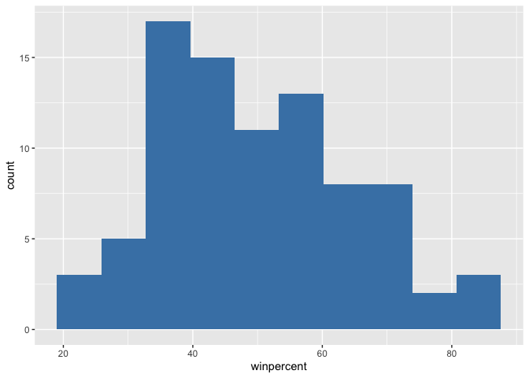
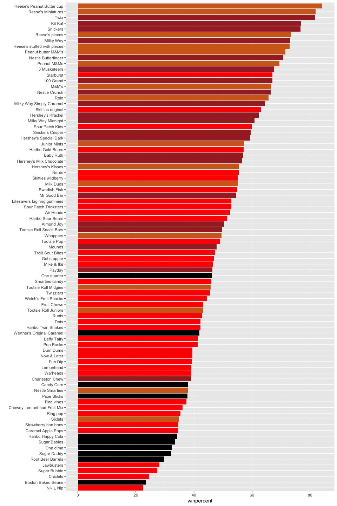
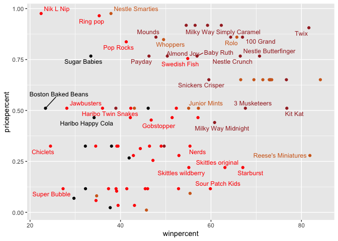
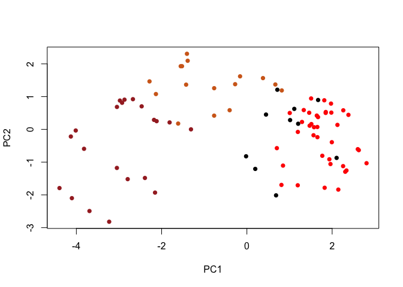
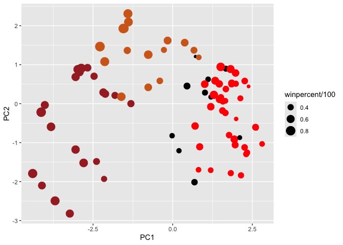
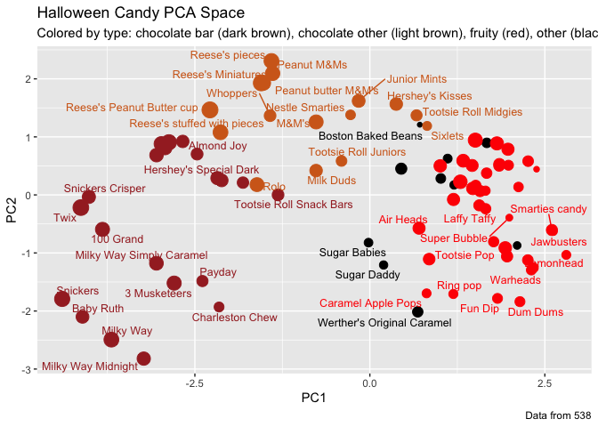
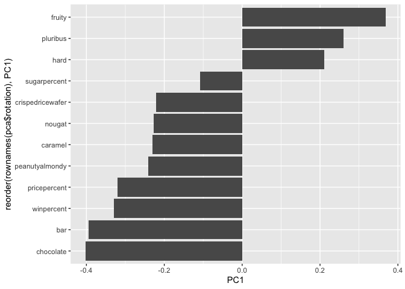

# Class 9: Candy Mini-Project
Christeena Pano (PID: A17842497)
2026-04-28

- [Background and Learning
  Objectives](#background-and-learning-objectives)
- [Data Import](#data-import)
- [What is in the dataset?](#what-is-in-the-dataset)
- [What is your favority candy?](#what-is-your-favority-candy)
- [Exploratory analysis](#exploratory-analysis)
- [Overall Candy Rankings](#overall-candy-rankings)
- [Time to add some useful color](#time-to-add-some-useful-color)
- [Taking a look at pricepercent](#taking-a-look-at-pricepercent)
- [Exploring the correlation
  structure](#exploring-the-correlation-structure)
- [Principal Component Analysis](#principal-component-analysis)

## Background and Learning Objectives

In this mini-project, you will explore FiveThirtyEight’s Halloween Candy
dataset. FiveThirtyEight, sometimes rendered as just 538, is an American
website that focuses mostly on opinion poll analysis, politics,
economics, and sports blogging. Your task is to explore their candy
dataset to find out answers to these types of questions.

- Import and explore an unfamiliar dataset to quickly characterize its
  structure and identify variables requiring special handling;

- Create and iteratively refine effective visualizations including
  ranked bar plots and scatter plots with ggrepel() labels, and
  interactive plotly() graphics to explore and communicate patterns in
  data;

- Generate and interpret correlation matrices to identify relationships
  between variables;

- Conduct principal component analysis (PCA) with appropriate scaling,
  interpret variance explained, and create score plots (PC1 vs PC2) to
  reveal clustering structure in high-dimensional data;

- Interpret PCA loadings to understand which original variables drive
  separation along principal components, connecting these back to the
  correlation structure;

- Synthesize multiple analyses (exploration, correlation, PCA) to draw
  substantive, data-driven conclusions.

## Data Import

``` r
# Import csv file with candy dataset
candy_file <- "https://raw.githubusercontent.com/fivethirtyeight/data/master/candy-power-ranking/candy-data.csv"

# Read the csv file into the dataframe and use the candy names as row names
candy <- read.csv(candy_file, row.names=1)

# Show first 6 rows of dataset using `head()`
head(candy)
```

                 chocolate fruity caramel peanutyalmondy nougat crispedricewafer
    100 Grand            1      0       1              0      0                1
    3 Musketeers         1      0       0              0      1                0
    One dime             0      0       0              0      0                0
    One quarter          0      0       0              0      0                0
    Air Heads            0      1       0              0      0                0
    Almond Joy           1      0       0              1      0                0
                 hard bar pluribus sugarpercent pricepercent winpercent
    100 Grand       0   1        0        0.732        0.860   66.97173
    3 Musketeers    0   1        0        0.604        0.511   67.60294
    One dime        0   0        0        0.011        0.116   32.26109
    One quarter     0   0        0        0.011        0.511   46.11650
    Air Heads       0   0        0        0.906        0.511   52.34146
    Almond Joy      0   1        0        0.465        0.767   50.34755

## What is in the dataset?

The dataset includes all sorts of information about different kinds of
candy. For example, is a candy chocolaty? Does it have nougat? How does
its cost compare to other candies? How many people prefer one candy over
another?

> **Q1**. How many different candy types are in this dataset?

``` r
# Use nrow() to count number of rows to see how many different candies there are
nrow(candy)
```

    [1] 85

There are 85 different candy types in this dataset.

> **Q2**. How many fruity candy types are in the dataset?

``` r
# Obtain sum of the "fruity" column to find out how many fruity candy types are in the dataset
sum(candy$fruity)
```

    [1] 38

There are 38 fruity candy types in the dataset.

## What is your favority candy?

Winpercent for a given candy is the percentage of people who prefer this
candy over another randomly chosen candy from the dataset. Higher values
indicate a more popular candy.

We can find the winpercent value for Almond Joy by using its name to
access the corresponding row of the dataset. This is because the dataset
has each candy name as rownames

``` r
# Find the winpercent value for Almond Joy by using its name to access the corresponding row of the dataset
candy["Almond Joy", ]$winpercent
```

    [1] 50.34755

Alternate way to find winpercent using dplyr package

``` r
# Load dplyr package 
library(dplyr)
```


    Attaching package: 'dplyr'

    The following objects are masked from 'package:stats':

        filter, lag

    The following objects are masked from 'package:base':

        intersect, setdiff, setequal, union

``` r
# Use dplyr functions `filter()` and `select()` to find Almond Joy winpercent by choosing the "winpercent" variable from the "Almond Joy" row
candy |> 
  filter(row.names(candy)=="Almond Joy") |> 
  select(winpercent)
```

               winpercent
    Almond Joy   50.34755

> **Q3**. What is your favorite candy (other than Twix) in the dataset
> and what is it’s winpercent value?

My favorite candy is Almond joy. Its winpercent value is 50.34755.

> **Q4**. What is the winpercent value for “Kit Kat”?

``` r
candy["Kit Kat", ]$winpercent
```

    [1] 76.7686

The winpercent value for “Kit Kat” is 76.7686.

> **Q5**. What is the winpercent value for “Tootsie Roll Snack Bars”?

``` r
candy["Tootsie Roll Snack Bars", ]$winpercent
```

    [1] 49.6535

The winpercent value for “Tootsie Roll Snack Bars” is 46.6535.

*Side-note*: the `skimr::skim()` function

There is a useful `skim()` function in the **skimr** package that can
help give you a quick overview of a given dataset.

``` r
# Install skimr packages
#install.packages("skimr")
```

``` r
# Instead of loading the entire library, extract one function, `skim()`, from the skimr package 
skimr::skim(candy)
```

|                                                  |       |
|:-------------------------------------------------|:------|
| Name                                             | candy |
| Number of rows                                   | 85    |
| Number of columns                                | 12    |
| \_\_\_\_\_\_\_\_\_\_\_\_\_\_\_\_\_\_\_\_\_\_\_   |       |
| Column type frequency:                           |       |
| numeric                                          | 12    |
| \_\_\_\_\_\_\_\_\_\_\_\_\_\_\_\_\_\_\_\_\_\_\_\_ |       |
| Group variables                                  | None  |

Data summary

**Variable type: numeric**

| skim_variable | n_missing | complete_rate | mean | sd | p0 | p25 | p50 | p75 | p100 | hist |
|:---|---:|---:|---:|---:|---:|---:|---:|---:|---:|:---|
| chocolate | 0 | 1 | 0.44 | 0.50 | 0.00 | 0.00 | 0.00 | 1.00 | 1.00 | ▇▁▁▁▆ |
| fruity | 0 | 1 | 0.45 | 0.50 | 0.00 | 0.00 | 0.00 | 1.00 | 1.00 | ▇▁▁▁▆ |
| caramel | 0 | 1 | 0.16 | 0.37 | 0.00 | 0.00 | 0.00 | 0.00 | 1.00 | ▇▁▁▁▂ |
| peanutyalmondy | 0 | 1 | 0.16 | 0.37 | 0.00 | 0.00 | 0.00 | 0.00 | 1.00 | ▇▁▁▁▂ |
| nougat | 0 | 1 | 0.08 | 0.28 | 0.00 | 0.00 | 0.00 | 0.00 | 1.00 | ▇▁▁▁▁ |
| crispedricewafer | 0 | 1 | 0.08 | 0.28 | 0.00 | 0.00 | 0.00 | 0.00 | 1.00 | ▇▁▁▁▁ |
| hard | 0 | 1 | 0.18 | 0.38 | 0.00 | 0.00 | 0.00 | 0.00 | 1.00 | ▇▁▁▁▂ |
| bar | 0 | 1 | 0.25 | 0.43 | 0.00 | 0.00 | 0.00 | 0.00 | 1.00 | ▇▁▁▁▂ |
| pluribus | 0 | 1 | 0.52 | 0.50 | 0.00 | 0.00 | 1.00 | 1.00 | 1.00 | ▇▁▁▁▇ |
| sugarpercent | 0 | 1 | 0.48 | 0.28 | 0.01 | 0.22 | 0.47 | 0.73 | 0.99 | ▇▇▇▇▆ |
| pricepercent | 0 | 1 | 0.47 | 0.29 | 0.01 | 0.26 | 0.47 | 0.65 | 0.98 | ▇▇▇▇▆ |
| winpercent | 0 | 1 | 50.32 | 14.71 | 22.45 | 39.14 | 47.83 | 59.86 | 84.18 | ▃▇▆▅▂ |

> **Q6**. Is there any variable/column that looks to be on a different
> scale to the majority of the other columns in the dataset?

Winpercent seems to be on a different scale than the majority of the
other columns in the dataset. The values seen in the winpercent row are
the only values not between 1 and 0. They are on a scale of 0-100.

> **Q7**. What do you think a zero and one represent for the
> candy\$chocolate column?

A zero means the candy does not contain chocolate and a 1 means the
candy does contain chocolate.

## Exploratory analysis

A good place to start any exploratory analysis is with a histogram. You
can do this most easily with the base R function `hist()`.
Alternatively, you can use `ggplot()` with `geom_hist()`.

> **Q8** Plot a histogram of winpercent values using both base R and
> ggplot2

``` r
# Plot histogram of winpercent values using base R
hist(candy$winpercent)
```


``` r
# Import ggplot2 library
library(ggplot2)

# Use ggplot to create histogram of winpercent values
ggplot(candy)+
  aes(winpercent)+
  geom_histogram(bins=10, fill="steelblue")
```



``` r
# Use `mean()` function to find mean of winpercent values
mean(candy$winpercent)
```

    [1] 50.31676

Median is better measure of centrality

``` r
# Use `median()` function to find mean of winpercent values
median(candy$winpercent)
```

    [1] 47.82975

> **Q9** Is the distribution of winpercent values symmetrical?

No, the distribution of winpercent values is not symmetrical.

> **Q10** Is the center of the distribution above or below 50%?

``` r
# Use `summary()` function to obtain values such as median to determine centrality 
summary(candy$winpercent)
```

       Min. 1st Qu.  Median    Mean 3rd Qu.    Max. 
      22.45   39.14   47.83   50.32   59.86   84.18 

The center of distribution is below 50%, as seen in the median which is
47.83.

> **Q11**. On average is chocolate candy higher or lower ranked than
> fruit candy?

``` r
# Turn "chocolate" feature into logical (a.k.a. TRUE/FALSE) values with the as.logical() function
choc.ind   <- as.logical(candy$chocolate)

# Use logical vector to access chocolate candy rows
choc.candy <- candy[choc.ind, ]

# Extract winpercent values for chocolate candy
choc.win   <- choc.candy$winpercent

# Find mean of winpercent values for chocolate candy
mean(choc.win)
```

    [1] 60.92153

``` r
# Use same method to find mean of winpercent values for fruit candy
fruit.ind   <- as.logical(candy$fruity)
fruit.candy <- candy[fruit.ind, ]
fruit.win   <- fruit.candy$winpercent
mean(fruit.win)
```

    [1] 44.11974

On average, chocolate candy is higher ranked than fruity candy as the
mean winpercent value for chocolate candy is higher than for fruity
candy.

> **Q12**. Is this difference statistically significant?

``` r
# Use a t-test to analyze statistical significant of the difference between winpercent values for chocolate and fruity candy
t.test(choc.win, fruit.win)
```


        Welch Two Sample t-test

    data:  choc.win and fruit.win
    t = 6.2582, df = 68.882, p-value = 2.871e-08
    alternative hypothesis: true difference in means is not equal to 0
    95 percent confidence interval:
     11.44563 22.15795
    sample estimates:
    mean of x mean of y 
     60.92153  44.11974 

Yes, the difference is statistically significant as the p-value is
small, 2.871e-08, which was found by using the function `t.test()`.

## Overall Candy Rankings

Use the base R `order()` function together with `head()` to sort the
whole dataset by a variable/column of interest.

> **Q13**. What are the five least liked candy types in this set?

The five least liked candy types in this dataset are Nik L Nip, Boston
Baked Beans, Chiclets, Super Bubble, and Jawbusters.

``` r
# Use the `order()` function with `head()` to sort the candy dataset by winpercent and set n = 5 for the 5 least liked candy types
head(candy[order(candy$winpercent), ], n = 5)
```

                       chocolate fruity caramel peanutyalmondy nougat
    Nik L Nip                  0      1       0              0      0
    Boston Baked Beans         0      0       0              1      0
    Chiclets                   0      1       0              0      0
    Super Bubble               0      1       0              0      0
    Jawbusters                 0      1       0              0      0
                       crispedricewafer hard bar pluribus sugarpercent pricepercent
    Nik L Nip                         0    0   0        1        0.197        0.976
    Boston Baked Beans                0    0   0        1        0.313        0.511
    Chiclets                          0    0   0        1        0.046        0.325
    Super Bubble                      0    0   0        0        0.162        0.116
    Jawbusters                        0    1   0        1        0.093        0.511
                       winpercent
    Nik L Nip            22.44534
    Boston Baked Beans   23.41782
    Chiclets             24.52499
    Super Bubble         27.30386
    Jawbusters           28.12744

> **Q14**. What are the top 5 all time favorite candy types out of this
> set?

``` r
# Use the `order()` function with `head()` to sort the candy dataset by winpercent and set n = 5
# Set decreasing = TRUE to find the highest winpercent values
head(candy[order(candy$winpercent, decreasing = TRUE), ], n = 5)
```

                              chocolate fruity caramel peanutyalmondy nougat
    Reese's Peanut Butter cup         1      0       0              1      0
    Reese's Miniatures                1      0       0              1      0
    Twix                              1      0       1              0      0
    Kit Kat                           1      0       0              0      0
    Snickers                          1      0       1              1      1
                              crispedricewafer hard bar pluribus sugarpercent
    Reese's Peanut Butter cup                0    0   0        0        0.720
    Reese's Miniatures                       0    0   0        0        0.034
    Twix                                     1    0   1        0        0.546
    Kit Kat                                  1    0   1        0        0.313
    Snickers                                 0    0   1        0        0.546
                              pricepercent winpercent
    Reese's Peanut Butter cup        0.651   84.18029
    Reese's Miniatures               0.279   81.86626
    Twix                             0.906   81.64291
    Kit Kat                          0.511   76.76860
    Snickers                         0.651   76.67378

The top 5 favorite candy types are Reese’s Peanut Butter cup, Reese’s
Miniatures, Twix, Kit Kat, and Snickers.

> **Q15**. Make a first barplot of candy ranking based on winpercent
> values.

``` r
# Load ggplot2
library(ggplot2)

# Make a first barplot of candy ranking based on winpercent values using ggplot
ggplot(candy) +
  aes(winpercent, rownames(candy)) +
  geom_col()
```


> **Q16**. This is quite ugly, use the `reorder()` function to get the
> bars sorted by winpercent?

``` r
# Barplot with candies sorted by winpercent

ggplot(candy) +
  aes(winpercent, reorder(rownames(candy), winpercent)) +
  geom_col()
```


## Time to add some useful color

Let’s setup a color vector (that signifies candy type) that we can then
use for some future plots. We start by making a vector of all black
values (one for each candy). Then we overwrite chocolate (for chocolate
candy), brown (for candy bars) and red (for fruity candy) values.

``` r
# Set up color vector of all gray values (one for each candy)
my_cols <- rep("black", nrow(candy))

# Overwrite chocolate for chocolate candy
my_cols[as.logical(candy$chocolate)] <- "chocolate"

# Overwrite brown for candy bars
my_cols[as.logical(candy$bar)] <- "brown"

# Overwrite red for fruity candy
my_cols[as.logical(candy$fruity)] <- "red"
```

``` r
# Make barplot with this color scheme
ggplot(candy) + 
  aes(winpercent, reorder(rownames(candy),winpercent)) +
  geom_col(fill=my_cols) +
  ylab("")
```



> **Q17**. What is the worst ranked chocolate candy?

The worst ranked chocolate candy is “Sixlets” as it is the lowest
chocolate candy on the barplot and has the lowest winpercent for
chocolate candies.

> **Q18**. What is the best ranked fruity candy?

The best ranked chocolate candy is “Starburst” as it is highest on the
barplot for fruity candy and has the highest winpercent for fruity
candy.

## Taking a look at pricepercent

What about value for money? What is the best candy for the least money?
One way to get at this would be to make a plot of winpercent vs the
pricepercent variable. The pricepercent variable records the percentile
rank of the candy’s price against all the other candies in the dataset.
Lower values are less expensive and higher values are more expensive.

To this plot we will add text labels so we can more easily identify a
given candy. There is a regular `geom_label()` that comes with ggplot2.
However, as there are quite a few candies in our dataset lots of these
labels will be overlapping and hard to read. To help with this we can
use the `geom_text_repel()` function from the *ggrepel* package.

``` r
#install.packages("ggrepel")
```

``` r
# Load ggrepel package
library(ggrepel)

# Plot winpercent vs pricepercent 
ggplot(candy) +
  aes(winpercent, pricepercent, label = rownames(candy)) +
  geom_point(col = my_cols) +
  geom_text_repel(col = my_cols, size = 3.3, max.overlaps = 5)
```



> **Q19**. Which candy type is the highest ranked in terms of winpercent
> for the least money - i.e. offers the most bang for your buck?

``` r
head(candy[order(candy$winpercent/candy$pricepercent, decreasing=TRUE), c(11,12)], n=1) 
```

                         pricepercent winpercent
    Tootsie Roll Midgies        0.011   45.73675

The candy type that is the highest ranked in terms of winpercent for the
least money is Tootsie Roll Midgies.

> **Q20**. What are the top 5 most expensive candy types in the dataset
> and of these which is the least popular?

``` r
# To see which candy is the most expensive we can order() the dataset by pricepercent.
ord <- order(candy$pricepercent, decreasing = TRUE)
head( candy[ord,c(11,12)], n=5 )
```

                             pricepercent winpercent
    Nik L Nip                       0.976   22.44534
    Nestle Smarties                 0.976   37.88719
    Ring pop                        0.965   35.29076
    Hershey's Krackel               0.918   62.28448
    Hershey's Milk Chocolate        0.918   56.49050

The top 5 most expensive candies are Nik L Nip, Nestle Smarties, Ring
Pop, Hershey’s Krackel, and Hershey’s Milk Chocolate. The least popular
is Nik L Nip as it has the lowest winpercent value.

``` r
#Using the dplyr package we can do the same thing

library(dplyr)
candy |>
  arrange(-pricepercent) |> 
  select(pricepercent, winpercent) |> 
  head(n=5)
```

                             pricepercent winpercent
    Nik L Nip                       0.976   22.44534
    Nestle Smarties                 0.976   37.88719
    Ring pop                        0.965   35.29076
    Hershey's Krackel               0.918   62.28448
    Hershey's Milk Chocolate        0.918   56.49050

## Exploring the correlation structure

We can calculate the pair-wise correlation of all our columns

``` r
#install.packages("corrplot")
```

``` r
# Import corrplot package
library(corrplot)
```

    corrplot 0.95 loaded

``` r
# Calculate correlation between all variables and view results in correlation plot
cij <- cor(candy)
corrplot(cij)
```


> **Q22**. Examining this plot what two variables are anti-correlated
> (i.e. have minus values)?

Chocolate and fruity are two variables that are anti-correlated because
the candies tend to either be fruity or chocolate and not both.

> **Q23**. Use your corrplot result to make a prediction: which
> variables do you expect will have the largest contributions
> (i.e. loadings) to PC1 (i.e., drive the most separation between
> candies along the first principal component)?

The variables I expect to have the largest contributions to PC1 are
chocolate, fruity, bar, pricepercent, and winpercent variables. These
variables drive the most separation between candies along the first
principal component.

## Principal Component Analysis

Apply PCA using the `prcomp()` function to our candy dataset remembering
to set the `scale=TRUE` argument because we have one variable
`winpercent` that is on a very different scale than all others and would
otherwise dominate our PCA results.

``` r
# Apply PCA on candy dataset and scale variables so each variable equally contributes to PCA
pca <- prcomp(candy, scale = TRUE)

# Create summary of results
summary(pca)
```

    Importance of components:
                              PC1    PC2    PC3     PC4    PC5     PC6     PC7
    Standard deviation     2.0788 1.1378 1.1092 1.07533 0.9518 0.81923 0.81530
    Proportion of Variance 0.3601 0.1079 0.1025 0.09636 0.0755 0.05593 0.05539
    Cumulative Proportion  0.3601 0.4680 0.5705 0.66688 0.7424 0.79830 0.85369
                               PC8     PC9    PC10    PC11    PC12
    Standard deviation     0.74530 0.67824 0.62349 0.43974 0.39760
    Proportion of Variance 0.04629 0.03833 0.03239 0.01611 0.01317
    Cumulative Proportion  0.89998 0.93832 0.97071 0.98683 1.00000

First major result figure is the “score plot” of PC1 vs. PC2 - how the
different candy are related to each other on our new PC axis:

``` r
# Plot PC1 vs PC2 scores
plot(pca$x[, 1:2])
```


``` r
# Change the plotting character and apply my_cols
plot(pca$x[,1:2], col=my_cols, pch=16)
```



``` r
# Make a new data-frame with our PCA results and candy data
my_data <- cbind(candy, pca$x[,1:3])
```

``` r
p <- ggplot(my_data) + 
        aes(x=PC1, y=PC2, 
            size=winpercent/100,  
            text=rownames(my_data),
            label=rownames(my_data)) +
        geom_point(col=my_cols)

p
```



Use the ggrepel package and the function `ggrepel::geom_text_repel()` to
label up the plot with non overlapping candy names like. Also add a
title and subtitle

``` r
library(ggrepel)

#label up the plot with non overlapping candy names 
p + geom_text_repel(size=3.3, col=my_cols, max.overlaps = 7)  + 
  theme(legend.position = "none") +
  labs(title="Halloween Candy PCA Space",
       subtitle="Colored by type: chocolate bar (dark brown), chocolate other (light brown), fruity (red), other (black)",
       caption="Data from 538")
```



``` r
#install.packages("plotly")
```

``` r
# Use "plotly" package
#library(plotly)

# Generate interactive plot to see all labels by hovering over each point
#ggplotly(p)
```

The second major results from PCA is the so-called “loadings plot”

Let’s finish by taking a quick look at PCA our loadings. Do these make
sense to you? Notice the opposite effects of chocolate and fruity and
the similar effects of chocolate and bar

``` r
# Generate a PCA loadings plot with PC1 vs PC2
ggplot(pca$rotation) +
  aes(PC1,
      reorder (rownames(pca$rotation), PC1))+
  geom_col()
```



> **Q24**. Complete the code to generate the loadings plot above. What
> original variables are picked up strongly by PC1 in the positive
> direction? Do these make sense to you? Where did you see this
> relationship highlighted previously?

The variables picked up strongly by PC1 in the positive direction are
fruity, pluribus, and hard. This makes sense to me because fruity candy
tends to be sold in multiple pieces and are a lot of times hard candy.
This is different than chococolate candies which tend to have nougat,
caramel, peanut or almond, and have higher winpercent. This relationship
was previously highlighted in the corrplot that showed the
anti-correlation between chocolate and fruity candy. The candy with
factors relating to fruity candy tend to not be chocolately, and vice
versa.

> **Q25**. Based on your exploratory analysis, correlation findings, and
> PCA results, what combination of characteristics appears to make a
> “winning” candy? How do these different analyses (visualization,
> correlation, PCA) support or complement each other in reaching this
> conclusion?

The combination of a chocolate candy that is not fruity and is in the
form of a bar appears to make a “winning” candy. Also having the
variables associated with chocolate candy like peanut, almond, or
caramel leads to a desirable candy. The visualization, correlation, and
PCA analysis support and complement each other in reaching this
conclusion as visualizing the data showed the most popular individual
candy, which tends to be chocolate. This data analysis works together
with the corrplot to show correlation between different candy variables.
Knowing chocolate candy has the highest winpercent values, we see
variables correlated with and anti-correlated with it. This allowed us
to see that chocolate and fruity candy are negatively correlated, so
fruity candy can be concluded to be less desirable. Finally, PCA
contributes to this analysis by showing the division between the candy
types, confirming the winning variables.
