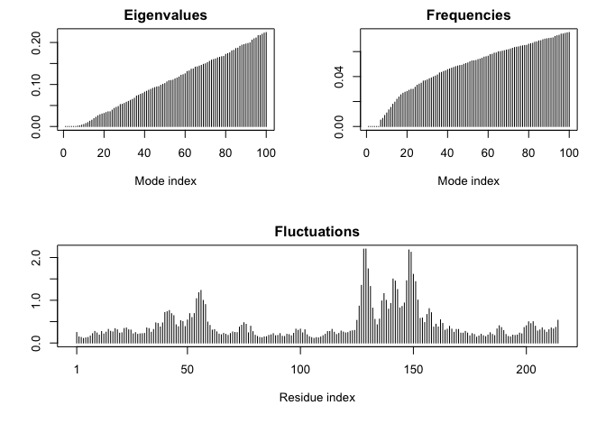
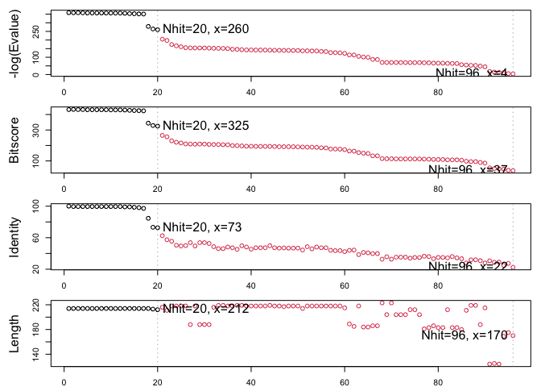

# Class 10: Structural Bioinformatics 1
Christeena Pano (PID: A17842497)
2026-04-30

- [Background](#background)
- [Introduction to the RCSB Protein Data Bank
  (PDB)](#introduction-to-the-rcsb-protein-data-bank-pdb)
- [PDB Statistics and Data Import](#pdb-statistics-and-data-import)
- [Visualizing PDB data with
  Mol-star](#visualizing-pdb-data-with-mol-star)
- [Getting started with the Bio3D
  package](#getting-started-with-the-bio3d-package)
  - [Predict the flexibility of a given
    structure](#predict-the-flexibility-of-a-given-structure)
  - [Comparative analysis of the ADK
    family](#comparative-analysis-of-the-adk-family)
  - [Principal Component Analysis](#principal-component-analysis)

## Background

The main repository of high-resolution structural data on biomolecules
is called the **Protein Data Bank** (PDB).

## Introduction to the RCSB Protein Data Bank (PDB)

The PDB archive is the major repository of information about the 3D
structures of large biological molecules, including proteins and nucleic
acids. Understanding the shape of these molecules helps to understand
how they work. This knowledge can be used to help deduce a structure’s
role in human health and disease, and in drug development. The
structures in the PDB range from tiny proteins and bits of DNA or RNA to
complex molecular machines like the ribosome composed of many chains of
protein and RNA.

In the first section of this lab we will interact with the main US based
PDB website.

## PDB Statistics and Data Import

What is in the PDB in terms of molecule type and structure determination
method.

Read a CSV file of current PDB stats obtained from
https://www.rcsb.org/stats/summary

``` r
# View data using read.csv()
pdb <- read.csv("Data Export Summary.csv")
pdb
```

               Molecular.Type   X.ray     EM    NMR Integrative Multiple.methods
    1          Protein (only) 180,758 23,111 12,813         348              229
    2 Protein/Oligosaccharide  10,488  3,741     34           8               11
    3              Protein/NA   9,205  6,751    287          26                8
    4     Nucleic acid (only)   3,154    250  1,578           3               15
    5                   Other     178     27     35           4                0
    6  Oligosaccharide (only)      11      0      6           0                1
      Neutron Other   Total
    1      84    32 217,375
    2       1     0  14,283
    3       0     0  16,277
    4       3     1   5,004
    5       0     0     244
    6       0     4      22

> **Q1**: What percentage of structures in the PDB are solved by X-Ray
> and Electron Microscopy.

The percentage of structures in the PDB solved by X-Ray is 80.48577%.
The percentage of structures in the PDB that are solved by Electron
Microscopy is 13.38046%.

``` r
pdb$X.ray
```

    [1] "180,758" "10,488"  "9,205"   "3,154"   "178"     "11"     

This print out adove `pdb$X.ray` is “character” not “numeric”. Therefore
I can’t do math with it. We need to fix this…

Two functions that can help here are `sub()` and `as.numeric()`

``` r
# We want to get rid (or sub out) commas: 
x <- pdb$X.ray
tmp <- sub(",", "", x)
sum(as.numeric(tmp))
```

    [1] 203794

We could make a function to do this:

``` r
# Sub out commas and assign function to rm.comma()
rm.comma <- function(x) {
  tmp <- sub(",", "", x)
  sum(as.numeric(tmp))
}
```

``` r
# use rm.comma() to find the proportions of structures found by each respective method
n.tot <- rm.comma(pdb$Total)
n.xray <- rm.comma(pdb$X.ray)
n.em <- rm.comma(pdb$EM)

n.xray/n.tot *100
```

    [1] 80.48577

``` r
n.em/n.tot * 100
```

    [1] 13.38046

We could also use a different import function \`for this CSV that speaks
American (i.e. deals with commas in numbers in a comma separated value
file)

``` r
library(readr)

read_csv("Data Export Summary.csv")
```

    Rows: 6 Columns: 9
    ── Column specification ────────────────────────────────────────────────────────
    Delimiter: ","
    chr (1): Molecular Type
    dbl (4): Integrative, Multiple methods, Neutron, Other
    num (4): X-ray, EM, NMR, Total

    ℹ Use `spec()` to retrieve the full column specification for this data.
    ℹ Specify the column types or set `show_col_types = FALSE` to quiet this message.

    # A tibble: 6 × 9
      `Molecular Type`    `X-ray`    EM   NMR Integrative `Multiple methods` Neutron
      <chr>                 <dbl> <dbl> <dbl>       <dbl>              <dbl>   <dbl>
    1 Protein (only)       180758 23111 12813         348                229      84
    2 Protein/Oligosacch…   10488  3741    34           8                 11       1
    3 Protein/NA             9205  6751   287          26                  8       0
    4 Nucleic acid (only)    3154   250  1578           3                 15       3
    5 Other                   178    27    35           4                  0       0
    6 Oligosaccharide (o…      11     0     6           0                  1       0
    # ℹ 2 more variables: Other <dbl>, Total <dbl>

> **Q2**: What proportion of structures in the PDB are protein?

The proportion of structures in the PDB that are protein is 97.92%.

``` r
pdb$Total[1]
```

    [1] "217,375"

The total number of protein sequences is 202,556,314, according to
Uniprot database.

``` r
 (217375/202556314) *100
```

    [1] 0.1073158

> **Key-point**: We have a very, very small structural coverage of known
> proteins (~0.1%). Most structures we know about (~%80) come from one
> method (X-ray crystalography)

``` r
# Find proportion of protein structures in the PDB database by using data from rows 1-3 and dividing by total
n.tot <- rm.comma(pdb$Total)
n.pro <- rm.comma(pdb$Total[1:3])

(n.pro / n.tot)
```

    [1] 0.9791868

> **Q3**: Type HIV in the PDB website search box on the home page and
> determine how many HIV-1 protease structures are in the current PDB?

There are 1227 HIV-1 protease structures in the current PDB.

## Visualizing PDB data with Mol-star

Main stand alone web version with all features is at
https://molstar.org/viewer/.

.png)


.png)

.png)

> **Q4**: Water molecules normally have 3 atoms. Why do we see just one
> atom per water molecule in this structure?

Since hydrogen only has one electron, it is not visible with the methods
used to solve/find these structures. Electron microscopy and X-ray
diffraction better detect the oxygen molecule. Therefore, only one atom
(oxygen) is used to represent the water molecules in this structure.

> **Q5**: There is a critical “conserved” water molecule in the binding
> site. Can you identify this water molecule? What residue number does
> this water molecule have

This water molecule is HOH 308.

> **Q6**: Generate and save a figure clearly showing the two distinct
> chains of HIV-protease along with the ligand. You might also consider
> showing the catalytic residues ASP 25 in each chain and the critical
> water (we recommend “Ball & Stick” for these side-chains). Add this
> figure to your Quarto document.

.png)

``` r
# Pak can install from multiple sources
#install.packages("pak")

#| eval: !expr knitr::is_html_output()

pak::pkg_install(c("bioboot/bio3dview", 
                   "NGLVieweR",
                   "bioc::msa"))
```

    ℹ Loading metadata database

    ✔ Loading metadata database ... done

     

    ℹ No downloads are needed

    ✔ 3 pkgs + 47 deps: kept 44 [7s]

``` r
#install.packages("bio3d")
library(bio3d)
```

# Getting started with the Bio3D package

Bio3D is an R package from CRAN for structural bioinformatics

``` r
library(bio3d)

pdb <- read.pdb("1hsg")
pdb
```

> **Q7**: How many amino acid residues are there in this pdb object?

There are 198 amino acid residues in this pdb object.

> **Q8**: Name one of the two non-protein residues?

MK1 is one of the two non-protein residues.

> **Q9**: How many protein chains are in this structure?

There are 2 protein chains in this structure.

``` r
head(pdb$atom)
```

    NULL

There are lots of functions that can work with these `pdb` objects:

``` r
#head( pdbseq(pdb))
```

``` r
#| eval: !expr knitr::is_html_output()

library(bio3dview)
library(NGLVieweR)

#| eval: !expr knitr::is_html_output()
#view.pdb(pdb) |> setSpin()
```

``` r
#install.packages("remotes")
remotes::install_github("bioboot/bio3dview")
```

    Using GitHub PAT from the git credential store.

    Skipping install of 'bio3dview' from a github remote, the SHA1 (568c6e99) has not changed since last install.
      Use `force = TRUE` to force installation

``` r
#install.packages("NGLVieweR")
```

let’s try a custom view

``` r
#view.pdb(pdb,colorScheme="sse", backgroundColor="black")
```

> Q. Create a custom view highlighting the active site ASP (`resno25`),
> the two chains (in your choice of colors) and the ligand all on a
> custom color backgroud

``` r
library(NGLVieweR)
active.site <- atom.select(pdb, resno=25)

#| eval: !expr knitr::is_html_output()

#view.pdb(pdb, 
         #cols= c("red", "blue"), 
         #highlight = active.site,
         #ighlight.style = "spacefill", 
         #backgroundColor= "pink") |>
  #setRock()
```

## Predict the flexibility of a given structure

Let’s do a Normal Mode Analysis (NMA) to predict the flexibility of a
given `pdb` object:

``` r
adk <- read.pdb("6s36")
```

      Note: Accessing on-line PDB file
       PDB has ALT records, taking A only, rm.alt=TRUE

``` r
adk
```


     Call:  read.pdb(file = "6s36")

       Total Models#: 1
         Total Atoms#: 1898,  XYZs#: 5694  Chains#: 1  (values: A)

         Protein Atoms#: 1654  (residues/Calpha atoms#: 214)
         Nucleic acid Atoms#: 0  (residues/phosphate atoms#: 0)

         Non-protein/nucleic Atoms#: 244  (residues: 244)
         Non-protein/nucleic resid values: [ CL (3), HOH (238), MG (2), NA (1) ]

       Protein sequence:
          MRIILLGAPGAGKGTQAQFIMEKYGIPQISTGDMLRAAVKSGSELGKQAKDIMDAGKLVT
          DELVIALVKERIAQEDCRNGFLLDGFPRTIPQADAMKEAGINVDYVLEFDVPDELIVDKI
          VGRRVHAPSGRVYHVKFNPPKVEGKDDVTGEELTTRKDDQEETVRKRLVEYHQMTAPLIG
          YYSKEAEAGNTKYAKVDGTKPVAEVRADLEKILG

    + attr: atom, xyz, seqres, helix, sheet,
            calpha, remark, call

``` r
# Plot data
m <- nma( adk )
```

     Building Hessian...        Done in 0.013 seconds.
     Diagonalizing Hessian...   Done in 0.406 seconds.

``` r
plot(m)
```



View the results with an interactive structure view

``` r
# Create interactive structure using view.nma()
#| eval: !expr knitr::is_html_output()

#view.nma(m)
```

Write out the results for viewing in Mol-star:

``` r
mktrj(m, file="nma.pdb")
```

## Comparative analysis of the ADK family

> **Q10**. Which of the packages above is found only on BioConductor and
> not CRAN?

msa is found only on BioConductor.

> **Q11**. Which of the above packages is not found on BioConductor or
> CRAN?

bio3dview is not found on Bioconductor or CRAN.

> **Q12**. True or False? Functions from the pak package can be used to
> install packages from GitHub and BitBucket?

This is true.

Our first step is find a sequence for this family. We will use the
database ID “1ake_A” here:

``` r
id <- "1ake_A"

aa <- get.seq(id)
```

    Warning in get.seq(id): Removing existing file: seqs.fasta

    Fetching... Please wait. Done.

``` r
aa
```

                 1        .         .         .         .         .         60 
    pdb|1AKE|A   MRIILLGAPGAGKGTQAQFIMEKYGIPQISTGDMLRAAVKSGSELGKQAKDIMDAGKLVT
                 1        .         .         .         .         .         60 

                61        .         .         .         .         .         120 
    pdb|1AKE|A   DELVIALVKERIAQEDCRNGFLLDGFPRTIPQADAMKEAGINVDYVLEFDVPDELIVDRI
                61        .         .         .         .         .         120 

               121        .         .         .         .         .         180 
    pdb|1AKE|A   VGRRVHAPSGRVYHVKFNPPKVEGKDDVTGEELTTRKDDQEETVRKRLVEYHQMTAPLIG
               121        .         .         .         .         .         180 

               181        .         .         .   214 
    pdb|1AKE|A   YYSKEAEAGNTKYAKVDGTKPVAEVRADLEKILG
               181        .         .         .   214 

    Call:
      read.fasta(file = outfile)

    Class:
      fasta

    Alignment dimensions:
      1 sequence rows; 214 position columns (214 non-gap, 0 gap) 

    + attr: id, ali, call

> **Q13**. How many amino acids are in this sequence, i.e. how long is
> this sequence?

There are 214 amino acids in this sequence.

Search for related sequences in the database

``` r
blast <- blast.pdb(aa)
```

     Searching ... please wait (updates every 5 seconds) RID = 2DU02Z17014 
     ..
     Reporting 96 hits

``` r
head(blast$hit.tbl)
```

            queryid subjectids identity alignmentlength mismatches gapopens q.start
    1 Query_1694041     1AKE_A  100.000             214          0        0       1
    2 Query_1694041     8BQF_A   99.533             214          1        0       1
    3 Query_1694041     4X8M_A   99.533             214          1        0       1
    4 Query_1694041     6S36_A   99.533             214          1        0       1
    5 Query_1694041     9R6U_A   99.533             214          1        0       1
    6 Query_1694041     9R71_A   99.533             214          1        0       1
      q.end s.start s.end    evalue bitscore positives mlog.evalue pdb.id    acc
    1   214       1   214 1.82e-156      432    100.00    358.6044 1AKE_A 1AKE_A
    2   214      21   234 2.98e-156      433    100.00    358.1114 8BQF_A 8BQF_A
    3   214       1   214 3.26e-156      432    100.00    358.0215 4X8M_A 4X8M_A
    4   214       1   214 4.78e-156      432    100.00    357.6388 6S36_A 6S36_A
    5   214       1   214 1.07e-155      431     99.53    356.8330 9R6U_A 9R6U_A
    6   214       1   214 1.26e-155      431     99.53    356.6696 9R71_A 9R71_A

``` r
hits <- plot(blast)
```

      * Possible cutoff values:    260 3 
                Yielding Nhits:    20 96 

      * Chosen cutoff value of:    260 
                Yielding Nhits:    20 



``` r
hits$pdb.id
```

     [1] "1AKE_A" "8BQF_A" "4X8M_A" "6S36_A" "9R6U_A" "9R71_A" "8Q2B_A" "8RJ9_A"
     [9] "6RZE_A" "4X8H_A" "3HPR_A" "1E4V_A" "5EJE_A" "1E4Y_A" "3X2S_A" "6HAP_A"
    [17] "6HAM_A" "8PVW_A" "4K46_A" "4NP6_A"

``` r
# Download releated PDB files
#files <- get.pdb(hits$pdb.id, path="pdbs", split=TRUE, gzip=TRUE)
```

``` r
# Align releated PDBs
#pdbs <- pdbaln(files, fit = TRUE, exefile="msa")
```

``` r
#pdbs
```

Quick interactive structure view

## Principal Component Analysis

PCA of all this structural data (x, y and z atom coordinates):

``` r
# Perform PCA
#pc <- pca(pdbs)
#plot(pc)
```

Interactive view of the PC1 captured structural differences:

``` r
# Create interactive view of the PC1 captured structural differences

#| eval: !expr knitr::is_html_output()

#view.pca(pc)
```
