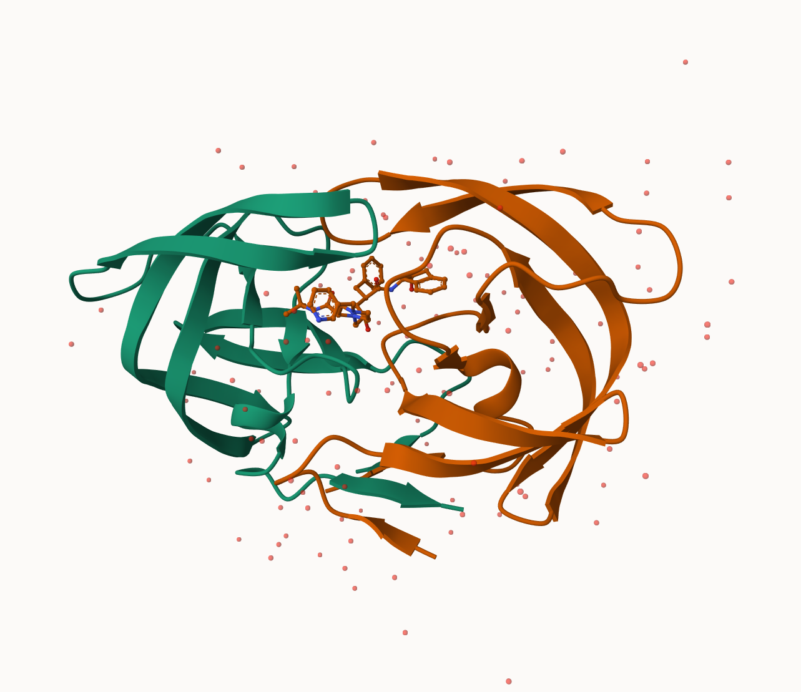

## Background

The main repository of high-resolution structural data on biomolecules is called the **Protein Data Bank** (PDB).

## Introduction to the RCSB Protein Data Bank (PDB)

The PDB archive is the major repository of information about the 3D structures of large biological molecules, including proteins and nucleic acids. Understanding the shape of these molecules helps to understand how they work. This knowledge can be used to help deduce a structure’s role in human health and disease, and in drug development. The structures in the PDB range from tiny proteins and bits of DNA or RNA to complex molecular machines like the ribosome composed of many chains of protein and RNA.

In the first section of this lab we will interact with the main US based PDB website.

## PDB Statistics and Data Import

What is in the PDB in terms of molecule type and structure determination method.

Read a CSV file of current PDB stats obtained from https://www.rcsb.org/stats/summary


```{r}
# View data using read.csv()
pdb <- read.csv("Data Export Summary.csv")
pdb
```
> **Q1**: What percentage of structures in the PDB are solved by X-Ray and Electron Microscopy.

The percentage of structures in the PDB solved by X-Ray is 80.48577%. The percentage of structures in the PDB that are solved by Electron Microscopy is 13.38046%.

```{r}
pdb$X.ray
```

This print out adove `pdb$X.ray` is "character" not "numeric". Therefore I can't do math with it. We need to fix this...

Two functions that can help here are `sub()` and `as.numeric()`

```{r}
# We want to get rid (or sub out) commas: 
x <- pdb$X.ray
tmp <- sub(",", "", x)
sum(as.numeric(tmp))
```

We could make a function to do this: 

```{r}
# Sub out commas and assign function to rm.comma()
rm.comma <- function(x) {
  tmp <- sub(",", "", x)
  sum(as.numeric(tmp))
}
```

```{r}
# use rm.comma() to find the proportions of structures found by each respective method
n.tot <- rm.comma(pdb$Total)
n.xray <- rm.comma(pdb$X.ray)
n.em <- rm.comma(pdb$EM)

n.xray/n.tot *100
n.em/n.tot * 100
```

We could also use a different import function `for this CSV that speaks American (i.e. deals with commas in numbers in a comma separated value file)

```{r}
library(readr)

read_csv("Data Export Summary.csv")
```

> **Q2**: What proportion of structures in the PDB are protein?

The proportion of structures in the PDB that are protein is 97.92%.

```{r}
pdb$Total[1]
```

The total number of protein sequences is 202,556,314, according to Uniprot database. 

```{r}
 (217375/202556314) *100
```

> **Key-point**: We have a very, very small structural coverage of known proteins (~0.1%). Most structures we know about (~%80) come from one method (X-ray crystalography)

```{r}
# Find proportion of protein structures in the PDB database by using data from rows 1-3 and dividing by total
n.tot <- rm.comma(pdb$Total)
n.pro <- rm.comma(pdb$Total[1:3])

(n.pro / n.tot)
```

> **Q3**: Type HIV in the PDB website search box on the home page and determine how many HIV-1 protease structures are in the current PDB?

There are 1227 HIV-1 protease structures in the current PDB.


## Visualizing PDB data with Mol-star

Main stand alone web version with all features is at https://molstar.org/viewer/.

.png)




.png)

.png)

> **Q4**: Water molecules normally have 3 atoms. Why do we see just one atom per water molecule in this structure?

Since hydrogen only has one electron, it is not visible with the methods used to solve/find these structures. Electron microscopy and X-ray diffraction better detect the oxygen molecule. Therefore, only one atom (oxygen) is used to represent the water molecules in this structure. 

> **Q5**: There is a critical “conserved” water molecule in the binding site. Can you identify this water molecule? What residue number does this water molecule have

This water molecule is HOH 308. 

> **Q6**: Generate and save a figure clearly showing the two distinct chains of HIV-protease along with the ligand. You might also consider showing the catalytic residues ASP 25 in each chain and the critical water (we recommend “Ball & Stick” for these side-chains). Add this figure to your Quarto document.

.png)

```{r}
# Pak can install from multiple sources
#install.packages("pak")

#| eval: !expr knitr::is_html_output()

pak::pkg_install(c("bioboot/bio3dview", 
                   "NGLVieweR",
                   "bioc::msa"))
```

```{r}
#install.packages("bio3d")
library(bio3d)
```


# Getting started with the Bio3D package

Bio3D is an R package from CRAN for structural bioinformatics

```{r}
#| eval: !expr knitr::is_html_output()

library(bio3d)

pdb <- read.pdb("1hsg")
pdb
```

> **Q7**: How many amino acid residues are there in this pdb object?

There are 198 amino acid residues in this pdb object. 

> **Q8**: Name one of the two non-protein residues? 

MK1 is one of the two non-protein residues.

> **Q9**: How many protein chains are in this structure?

There are 2 protein chains in this structure. 

```{r}
head(pdb$atom)
```

There are lots of functions that can work with these `pdb` objects:

```{r}
#head( pdbseq(pdb))
```

```{r}

#| eval: !expr knitr::is_html_output()

library(bio3dview)
library(NGLVieweR)

#| eval: !expr knitr::is_html_output()
#view.pdb(pdb) |> setSpin()
```

```{r}
#install.packages("remotes")
remotes::install_github("bioboot/bio3dview")
#install.packages("NGLVieweR")
```

let's try a custom view
```{r}
#| eval: !expr knitr::is_html_output()

#view.pdb(pdb,colorScheme="sse", backgroundColor="black")
```

> Q. Create a custom view highlighting the active site ASP (`resno25`), the two chains (in your choice of colors) and the ligand all on a custom color backgroud

```{r}
#| eval: !expr knitr::is_html_output()
library(NGLVieweR)
active.site <- atom.select(pdb, resno=25)

#| eval: !expr knitr::is_html_output()

#view.pdb(pdb, 
         cols= c("red", "blue"), 
         highlight = active.site,
         highlight.style = "spacefill", 
         backgroundColor= "pink") |>
  setRock()
```

## Predict the flexibility of a given structure

Let's do a Normal Mode Analysis (NMA) to predict the flexibility of a given `pdb` object:

```{r}
adk <- read.pdb("6s36")
adk
```

```{r}
# Plot data
m <- nma( adk )
plot(m)
```

View the results with an interactive structure view
```{r}
# Create interactive structure using view.nma()
#| eval: !expr knitr::is_html_output()

view.nma(m)
```

Write out the results for viewing in Mol-star: 

```{r}
mktrj(m, file="nma.pdb")
```

## Comparative analysis of the ADK family 

> **Q10**. Which of the packages above is found only on BioConductor and not CRAN? 

msa is found only on BioConductor.

> **Q11**. Which of the above packages is not found on BioConductor or CRAN?

bio3dview is not found on Bioconductor or CRAN.

> **Q12**. True or False? Functions from the pak package can be used to install packages from GitHub and BitBucket? 

This is true. 

Our first step is find a sequence for this family. We will use the database ID "1ake_A" here: 

```{r}
id <- "1ake_A"

aa <- get.seq(id)
aa
```

> **Q13**. How many amino acids are in this sequence, i.e. how long is this sequence?

There are 214 amino acids in this sequence.

Search for related sequences in the database

```{r}
blast <- blast.pdb(aa)
```

```{r}
head(blast$hit.tbl)
```

```{r}
hits <- plot(blast)
```

```{r}
hits$pdb.id
```

```{r}
# Download releated PDB files
files <- get.pdb(hits$pdb.id, path="pdbs", split=TRUE, gzip=TRUE)
```

```{r}
# Align releated PDBs
pdbs <- pdbaln(files, fit = TRUE, exefile="msa")
```

```{r}
pdbs
```

Quick interactive structure view

```{r}
# Quick interactive structure view
#| eval: !expr knitr::is_html_output()

#view.pdbs(pdbs)
```

```{r}
# Vector containing PDB database codes
ids <- basename.pdb(pdbs$id)

anno <- pdb.annotate(ids)
unique(anno$source)
```
```{r}
anno
```

## Principal Component Analysis

PCA of all this structural data (x, y and z atom coordinates): 

```{r}
# Perform PCA
pc <- pca(pdbs)
plot(pc)
```

```{r}
# Create plot with PC 1 and 2
plot(pc, 1:2)
```

Interactive view of the PC1 captured structural differences: 

```{r}
# Create interactive view of the PC1 captured structural differences

#| eval: !expr knitr::is_html_output()

#view.pca(pc)
```
```{r}
# Calculate RMSD
rd <- rmsd(pdbs)

# Structure-based clustering
hc.rd <- hclust(dist(rd))
grps.rd <- cutree(hc.rd, k=3)

plot(pc, 1:2, col="grey50", bg=grps.rd, pch=21, cex=1)
```


```{r}
# Visualize first principal component
pc1 <- mktrj(pc, pc=1, file="pca.pdb")
```

