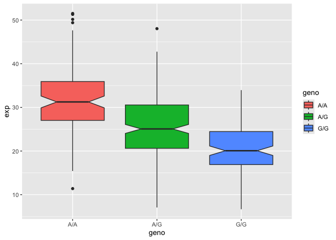

# Homework 12: Population Scale Analysis
Christeena Pano (PID: A17842497)
2026-05-10

- [Population Scale Analysis](#population-scale-analysis)

One sample is not enough to know what is happening in a population. You
are interested in assessing genetic differences on a population scale.
So, you processed about ~230 samples and did the normalization on a
genome level. Now, you want to find whether there is any association of
the 4 asthma-associated SNPs (rs8067378…) on ORMDL3 expression.

## Population Scale Analysis

``` r
# Read the data
url <- "https://bioboot.github.io/bimm143_S26/class-material/rs8067378_ENSG00000172057.6.txt"
expr <- read.table(url)

# Check the data
head(data)
```

                                                                                
    1 function (..., list = character(), package = NULL, lib.loc = NULL,        
    2     verbose = getOption("verbose"), envir = .GlobalEnv, overwrite = TRUE) 
    3 {                                                                         
    4     fileExt <- function(x) {                                              
    5         db <- grepl("\\\\.[^.]+\\\\.(gz|bz2|xz)$", x)                     
    6         ans <- sub(".*\\\\.", "", x)                                      

> **Q13**: Read this file into R and determine the sample size for each
> genotype and their corresponding median expression levels for each of
> these genotypes.

The sample size for A/A is 108 with a median expression level of
31.24847. The sample size for A/G is 233 with a median expression level
of 25.06486. The sample size for G/G is 121 with a median expression
level of 20.07363.

``` r
nrow(expr)
```

    [1] 462

Find how many samples belong to each genotype in this dataset

``` r
# Sample size for each genotype
table(expr$geno)
```


    A/A A/G G/G 
    108 233 121 

Find the median expression level for each genotype by using `median()`
and extraction exp from each genotype group of the dataset

``` r
# Use median () to find the median for the expression level by genotype group
median(expr$exp[expr$geno == "A/A"])
```

    [1] 31.24847

``` r
median(expr$exp[expr$geno == "A/G"])
```

    [1] 25.06486

``` r
median(expr$exp[expr$geno == "G/G"]) 
```

    [1] 20.07363

> **Q14**: Generate a boxplot with a box per genotype, what could you
> infer from the relative expression value between A/A and G/G displayed
> in this plot? Does the SNP effect the expression of ORMDL3?

Use ggplot2 to crease a boxplot of genotype and expression to compare
expression levels by genotype.

``` r
# Load ggplot2
library(ggplot2)
```

From the boxplot, it is clear that A/A has higher levels of expression
than G/G genotype. This suggests that allele variation has an
impact/effect or correlation with the expression of ORMDL3. Due to
varying expression levels with G/G having the lowest, and A/G having
mid-level expression, it can be concluded that the SNP does affect the
expression of ORMDL3.

Make a boxplot

``` r
# Use ggplot to make the boxplot, filling in boxes by color acording to genotype
# Set notch=true to define a median for each genotype group
ggplot(expr) + aes(geno, exp, fill=geno) +
  geom_boxplot(notch=TRUE)
```


