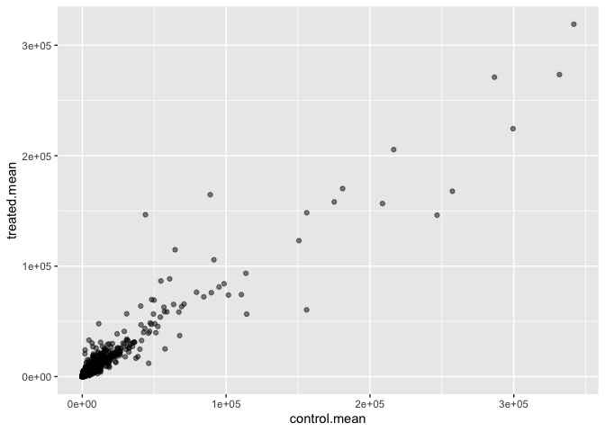
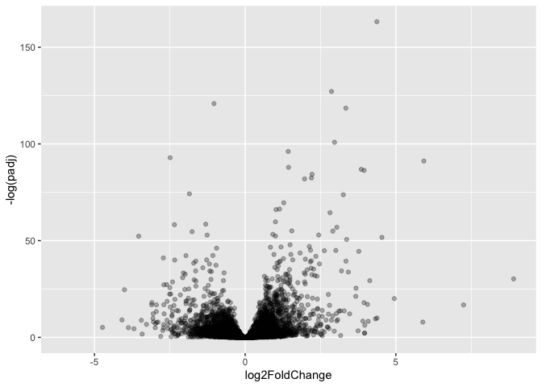
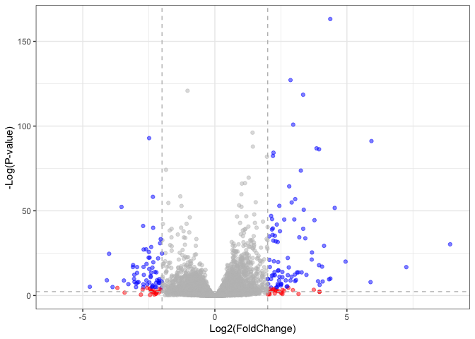
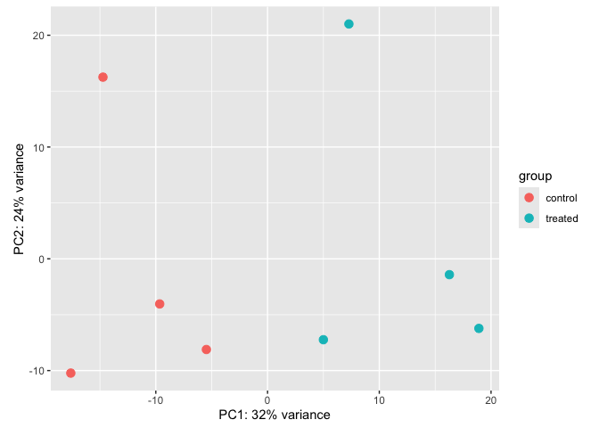

# Class 13: Transcriptomics and the analysis of RNA-Seq data
Christeena Pano (PID: A17842497)
2026-05-12

- [Background](#background)
- [Data Import](#data-import)
- [Toy differential gene expression](#toy-differential-gene-expression)
- [DESeq analysis](#deseq-analysis)
- [Volcano plot](#volcano-plot)
- [Save our results to date](#save-our-results-to-date)
- [Principal Component Analysis
  (PCA)](#principal-component-analysis-pca)
- [Adding annotation data](#adding-annotation-data)
- [Pathway Analysis](#pathway-analysis)
- [Save our annotated results](#save-our-annotated-results)

## Background

Today we are going to do RNA Seq analysis of a data set on the common
glucocorticoid steroid dexamethasone (Dex), and we’ll use DESeq for this
analysis.

``` r
# Install packages in console

#install.packages("BiocManager")
#BiocManager::install()
```

``` r
# Install packages in console

# For this class we will need DESeq2:
#BiocManager::install("DESeq2")
```

## Data Import

Let’s read the `count` data and `metadata` abouot this experiment setup
from the supplied CSV files

``` r
# Read count data and metadata files
metadata <- read.csv("airway_metadata.csv")
counts <- read.csv("airway_scaledcounts.csv", row.names=1)
```

Have a wee peak:

``` r
# look at the head for counts data
head(counts)
```

                    SRR1039508 SRR1039509 SRR1039512 SRR1039513 SRR1039516
    ENSG00000000003        723        486        904        445       1170
    ENSG00000000005          0          0          0          0          0
    ENSG00000000419        467        523        616        371        582
    ENSG00000000457        347        258        364        237        318
    ENSG00000000460         96         81         73         66        118
    ENSG00000000938          0          0          1          0          2
                    SRR1039517 SRR1039520 SRR1039521
    ENSG00000000003       1097        806        604
    ENSG00000000005          0          0          0
    ENSG00000000419        781        417        509
    ENSG00000000457        447        330        324
    ENSG00000000460         94        102         74
    ENSG00000000938          0          0          0

and the metadata that tells us what is actually in the columns of our
`counts` object:

``` r
# look at the head for metadata
head(metadata)
```

              id     dex celltype     geo_id
    1 SRR1039508 control   N61311 GSM1275862
    2 SRR1039509 treated   N61311 GSM1275863
    3 SRR1039512 control  N052611 GSM1275866
    4 SRR1039513 treated  N052611 GSM1275867
    5 SRR1039516 control  N080611 GSM1275870
    6 SRR1039517 treated  N080611 GSM1275871

> **Q1**. How many genes are in this dataset?

There are 38694 genes in this dataset

``` r
# Use `nrow()` to find number of genes in the dataset
nrow(counts)
```

    [1] 38694

> **Q2**. How many ‘control’ cell lines do we have?

There are 4 ‘control’ cell lines.

``` r
# Count how many samples are 'control'
sum(metadata$dex=="control")
```

    [1] 4

## Toy differential gene expression

Look at the metadata object again to see which samples are control and
which are drug treated.

``` r
# Find the sample id for those labeled control. Then calculate the mean counts per gene across these samples
control <- metadata[metadata[,"dex"]=="control",]
control.counts <- counts[ ,control$id]
control.mean <- rowSums( control.counts )/4 
head(control.mean)
```

    ENSG00000000003 ENSG00000000005 ENSG00000000419 ENSG00000000457 ENSG00000000460 
             900.75            0.00          520.50          339.75           97.25 
    ENSG00000000938 
               0.75 

``` r
# Alternative way to do the same thing using the dplyr package from the tidyverse
library(dplyr)
```


    Attaching package: 'dplyr'

    The following objects are masked from 'package:stats':

        filter, lag

    The following objects are masked from 'package:base':

        intersect, setdiff, setequal, union

``` r
control <- metadata %>% filter(dex=="control")
control.counts <- counts %>% select(control$id) 
control.mean <- rowSums(control.counts)/4
head(control.mean)
```

    ENSG00000000003 ENSG00000000005 ENSG00000000419 ENSG00000000457 ENSG00000000460 
             900.75            0.00          520.50          339.75           97.25 
    ENSG00000000938 
               0.75 

> **Q3**. How would you make the above code in either approach more
> robust? Is there a function that could help here?

Since the code specifies dividing by four, adding additional samples
would make the mean incorrect. To fix this, we can find the “control”
columns in the `counts` data, extract only these column values, and
calculate the average value per gene in these columns. The function
`rowMeans() can be used for this` in the code below.

- Find the “control” columns in our `counts` object
- Extract just the “control” column values for all genes
- Calculate the average value per gene in these “control” columns

``` r
control.inds <- metadata$dex == "control"
control.counts <- counts[,control.inds]
control.mean <- rowMeans(control.counts)
```

``` r
head(control.mean)
```

    ENSG00000000003 ENSG00000000005 ENSG00000000419 ENSG00000000457 ENSG00000000460 
             900.75            0.00          520.50          339.75           97.25 
    ENSG00000000938 
               0.75 

Now we do the same for “treated” samples

> **Q4**. Follow the same procedure for the treated samples
> (i.e. calculate the mean per gene across drug treated samples and
> assign to a labeled vector called treated.mean)

``` r
# Find "treated" columns in `counts`, extract these columns, calculate average per gene for these columns
treated.mean <- rowMeans( counts[, metadata$dex=="treated"])
head(treated.mean)
```

    ENSG00000000003 ENSG00000000005 ENSG00000000419 ENSG00000000457 ENSG00000000460 
             658.00            0.00          546.00          316.50           78.75 
    ENSG00000000938 
               0.00 

``` r
# Calculate the mean per gene across drug treated samples and assign to a labeled vector called treated.mean

treated.inds <- metadata$dex == "treated"
treated.counts <- counts[,treated.inds]
treated.mean <- rowMeans(treated.counts)
head(treated.mean)
```

    ENSG00000000003 ENSG00000000005 ENSG00000000419 ENSG00000000457 ENSG00000000460 
             658.00            0.00          546.00          316.50           78.75 
    ENSG00000000938 
               0.00 

``` r
# Combine our meancount data
meancounts <- data.frame(control.mean, treated.mean)
head(meancounts)
```

                    control.mean treated.mean
    ENSG00000000003       900.75       658.00
    ENSG00000000005         0.00         0.00
    ENSG00000000419       520.50       546.00
    ENSG00000000457       339.75       316.50
    ENSG00000000460        97.25        78.75
    ENSG00000000938         0.75         0.00

``` r
# colSums() the data to show the sum of the mean counts across all genes for each group

colSums(meancounts)
```

    control.mean treated.mean 
        23005324     22196524 

> **Q5 (a)**. Create a scatter plot showing the mean of the treated
> samples against the mean of the control samples.

``` r
plot(meancounts)
```


> **Q5 (b)**.You could also use the ggplot2 package to make this figure
> producing the plot below. What geom\_?() function would you use for
> this plot?

geom_point() would be used for this plot.

``` r
# Load and use the ggplot2 package to make this figure

library(ggplot2)
ggplot(meancounts, aes(x=control.mean, y=treated.mean)) +
  geom_point(alpha=0.5)
```



Our count data is highly skewed and when we see a pattern like this plot
it SCREAMS log transfrom me!

> **Q6**. Try plotting both axes on a log scale. What is the argument to
> plot() that allows you to do this?

The plot generated using a log scale is shown below. The argument to
plot() is log=“xy”.

``` r
plot(meancounts, log="xy")
```

    Warning in xy.coords(x, y, xlabel, ylabel, log): 15032 x values <= 0 omitted
    from logarithmic plot

    Warning in xy.coords(x, y, xlabel, ylabel, log): 15281 y values <= 0 omitted
    from logarithmic plot


We most often use log2 transform for this kind of data in bioinformatics
because it makes interpretation much easier.

**log2 fold change** tells us how much more or less gene expression we
have in units of doubling, etc.

Let’s calculate log2 fold change for our `treated.mean` and
`control.mean` counts and call this `log2fc`

``` r
# Calculate log2foldchange, add it to our meancounts data.frame and inspect results with the head() function

meancounts$log2fc <- log2(meancounts$treated.mean / meancounts$control.mean)

head(meancounts)
```

                    control.mean treated.mean      log2fc
    ENSG00000000003       900.75       658.00 -0.45303916
    ENSG00000000005         0.00         0.00         NaN
    ENSG00000000419       520.50       546.00  0.06900279
    ENSG00000000457       339.75       316.50 -0.10226805
    ENSG00000000460        97.25        78.75 -0.30441833
    ENSG00000000938         0.75         0.00        -Inf

The NaN and -Inf results look odd. Filter our data to remove these genes

``` r
# Find where control or treated mean is 0
zero.vals <- which(meancounts[,1:2]==0, arr.ind=TRUE)

# Calling unique() will ensure we don’t count any row twice 
to.rm <- unique(zero.vals[,1])

# Remove these genes
mycounts <- meancounts[-to.rm,]
head(mycounts)
```

                    control.mean treated.mean      log2fc
    ENSG00000000003       900.75       658.00 -0.45303916
    ENSG00000000419       520.50       546.00  0.06900279
    ENSG00000000457       339.75       316.50 -0.10226805
    ENSG00000000460        97.25        78.75 -0.30441833
    ENSG00000000971      5219.00      6687.50  0.35769358
    ENSG00000001036      2327.00      1785.75 -0.38194109

> **Q7**. What is the purpose of the arr.ind argument in the which()
> function call above? Why would we then take the first column of the
> output and need to call the unique() function?

The purpose of the arr.ind=TRUE argument is that it causes the which()
function to return row and column positions where the values are true.
Since we are looking for indices where the mean counts are zero, those
are the indices returned when using this argument. Only the first column
is taken because this shows which genes have count means of zero. Only
the row answer needs to be focused on to ignore genes with a 0 count
mean. The unique() function makes sure rows are not counted twice if
there are zeros in both samples.

A common “rule of thumb” threshold for calling a gene “up regulated” or
“down regulated” is a log2 fold change value of +2 or -2 (or greater)

``` r
# Filter the dataset both ways to see how many genes are up or down-regulated
up.ind <- mycounts$log2fc > 2
down.ind <- mycounts$log2fc < (-2)
```

``` r
# Use sum() to find total genes less than or greater than 2 fc.
sum(up.ind)
```

    [1] 250

``` r
sum(down.ind)
```

    [1] 367

> **Q8**. Using the up.ind vector above can you determine how many up
> regulated genes we have at the greater than 2 fc level?

At the greater than 2 fc level, there are 250 genes.

> **Q9**. Using the down.ind vector above can you determine how many
> down regulated genes we have at the greater than 2 fc level?

At the greater than 2 fc level, there are 367 genes.

> **Q10**. Do you trust these results? Why or why not?

No, I do not trust these results. The current results are based only on
fold change which can be large without being statistically significant.
Without doing any statistical test to determine significance, such as
using p-values, the results can be misleading.

## DESeq analysis

Let’s do this analysis properly and not forget about the significance of
the differences.

For this we will use the **DESeq2** package

``` r
library(DESeq2)
citation("DESeq2")
```

    To cite package 'DESeq2' in publications use:

      Love, M.I., Huber, W., Anders, S. Moderated estimation of fold change
      and dispersion for RNA-seq data with DESeq2 Genome Biology 15(12):550
      (2014)

    A BibTeX entry for LaTeX users is

      @Article{,
        title = {Moderated estimation of fold change and dispersion for RNA-seq data with DESeq2},
        author = {Michael I. Love and Wolfgang Huber and Simon Anders},
        year = {2014},
        journal = {Genome Biology},
        doi = {10.1186/s13059-014-0550-8},
        volume = {15},
        issue = {12},
        pages = {550},
      }

To run a DESeq analysis we need at least two inputs:

- `countData` i.e. are gene counts across different experiments
- `colData` i.e. our metadata about those count columns

``` r
dds <- DESeqDataSetFromMatrix(countData=counts, 
                              colData=metadata, 
                              design=~dex)
```

    converting counts to integer mode

``` r
dds
```

    class: DESeqDataSet 
    dim: 38694 8 
    metadata(1): version
    assays(1): counts
    rownames(38694): ENSG00000000003 ENSG00000000005 ... ENSG00000283120
      ENSG00000283123
    rowData names(0):
    colnames(8): SRR1039508 SRR1039509 ... SRR1039520 SRR1039521
    colData names(4): id dex celltype geo_id

If we try to access these results before running the analysis, nothing
exists

Now we can run the DESeq analysis pipeline using this `dds` object that
has all the inputs we need

``` r
dds <- DESeq(dds)
```

    estimating size factors

    estimating dispersions

    gene-wise dispersion estimates

    mean-dispersion relationship

    final dispersion estimates

    fitting model and testing

``` r
res <- results(dds)
head(res)
```

    log2 fold change (MLE): dex treated vs control 
    Wald test p-value: dex treated vs control 
    DataFrame with 6 rows and 6 columns
                      baseMean log2FoldChange     lfcSE      stat    pvalue
                     <numeric>      <numeric> <numeric> <numeric> <numeric>
    ENSG00000000003 747.194195      -0.350703  0.168242 -2.084514 0.0371134
    ENSG00000000005   0.000000             NA        NA        NA        NA
    ENSG00000000419 520.134160       0.206107  0.101042  2.039828 0.0413675
    ENSG00000000457 322.664844       0.024527  0.145134  0.168996 0.8658000
    ENSG00000000460  87.682625      -0.147143  0.256995 -0.572550 0.5669497
    ENSG00000000938   0.319167      -1.732289  3.493601 -0.495846 0.6200029
                         padj
                    <numeric>
    ENSG00000000003  0.163017
    ENSG00000000005        NA
    ENSG00000000419  0.175937
    ENSG00000000457  0.961682
    ENSG00000000460  0.815805
    ENSG00000000938        NA

``` r
# summarize some basic tallies using the summary function
summary(res)
```


    out of 25258 with nonzero total read count
    adjusted p-value < 0.1
    LFC > 0 (up)       : 1564, 6.2%
    LFC < 0 (down)     : 1188, 4.7%
    outliers [1]       : 142, 0.56%
    low counts [2]     : 9971, 39%
    (mean count < 10)
    [1] see 'cooksCutoff' argument of ?results
    [2] see 'independentFiltering' argument of ?results

The results function contains a number of arguments to customize the
results table. By default the argument alpha is set to 0.1. If the
adjusted p value cutoff will be a value other than 0.1, alpha should be
set to that value:

``` r
res05 <- results(dds, alpha=0.05)
summary(res05)
```


    out of 25258 with nonzero total read count
    adjusted p-value < 0.05
    LFC > 0 (up)       : 1237, 4.9%
    LFC < 0 (down)     : 933, 3.7%
    outliers [1]       : 142, 0.56%
    low counts [2]     : 9033, 36%
    (mean count < 6)
    [1] see 'cooksCutoff' argument of ?results
    [2] see 'independentFiltering' argument of ?results

## Volcano plot

This is a ubiquitous and common visualization for this type of data that
puts the log2 foldchange and the adjusted p-value together in one plot
that people can get insight for what is going on in the whole dataset
results.

``` r
plot( res$log2FoldChange,  -log(res$padj), 
      xlab="Log2(FoldChange)",
      ylab="-Log(P-value)")
```


``` r
# Add some guidelines (with the abline() function) and color (with a custom color vector) highlighting genes that have padj<0.05 and the absolute log2FoldChange>2
plot( res$log2FoldChange,  -log(res$padj), 
 ylab="-Log(P-value)", xlab="Log2(FoldChange)")

# Add some cut-off lines
abline(v=c(-2,2), col="darkgray", lty=2)
abline(h=-log(0.05), col="darkgray", lty=2)
```


``` r
# Setup our custom point color vector 
mycols <- rep("gray", nrow(res))
mycols[ abs(res$log2FoldChange) > 2 ]  <- "red" 

inds <- (res$padj < 0.01) & (abs(res$log2FoldChange) > 2 )
mycols[ inds ] <- "blue"

# Volcano plot with custom colors 
plot( res$log2FoldChange,  -log(res$padj), 
 col=mycols, ylab="-Log(P-value)", xlab="Log2(FoldChange)" )

# Cut-off lines
abline(v=c(-2,2), col="gray", lty=2)
abline(h=-log(0.1), col="gray", lty=2)
```


Do same thing with ggplot2

``` r
library(ggplot2)
```

``` r
ggplot(res) + 
  aes(log2FoldChange, padj) + 
  geom_point(alpha=0.3)
```

    Warning: Removed 23549 rows containing missing values or values outside the scale range
    (`geom_point()`).


That plot is not very useful because we don’t care about genes with high
p-values, we want the very low values below our alpha threshold
(e.g. 0.01)

Let’s log the y-axis so we can see these genes/points more clearly:

``` r
ggplot(res) + 
  aes(log2FoldChange, log(padj)) + 
  geom_point(alpha=0.3)
```

    Warning: Removed 23549 rows containing missing values or values outside the scale range
    (`geom_point()`).


We need to flip the y-axis so our “volcano” is not upside down

``` r
ggplot(res) + 
  aes(log2FoldChange, -log(padj)) + 
  geom_point(alpha=0.3)
```

    Warning: Removed 23549 rows containing missing values or values outside the scale range
    (`geom_point()`).



> Q. add annotation to this volcano plot including the log2 fold-change
> thersholds of +2 and -2 and the p-value threshold of 0.05. Also color
> up just the genes that meet both these thresholds.

``` r
# Create a color column in res 
res$color <- "gray"
# Red if absolute log2FoldChange > 2
res$color[abs(res$log2FoldChange) > 2] <- "red"
# Blue if padj < 0.01 AND absolute log2FoldChange > 2
res$color[( res$padj < 0.01) & (abs(res$log2FoldChange) > 2)] <- "blue"

# Use ggplot2 to create the volcano plot with the custom colors
ggplot(as.data.frame(res), aes(x = log2FoldChange, y = -log(padj))) +
  geom_point(aes(color = color), alpha = 0.5) +
  scale_color_identity() +
  # Add vertical cut-off lines at log2FC = -2 and 2
  geom_vline(xintercept = c(-2, 2), col = "gray", lty = 2) +
  # Add horizontal cut-off line at -log(0.1)
  geom_hline(yintercept = -log(0.1), col = "gray", lty = 2) +
  labs(x = "Log2(FoldChange)", y = "-Log(P-value)") +
  theme_bw()
```

    Warning: Removed 23549 rows containing missing values or values outside the scale range
    (`geom_point()`).



``` r
#BiocManager::install("EnhancedVolcano")

library(EnhancedVolcano)
```

    Loading required package: ggrepel

## Save our results to date

``` r
write.csv(res, file="myresults.csv")
```

``` r
summary(res)
```


    out of 25258 with nonzero total read count
    adjusted p-value < 0.1
    LFC > 0 (up)       : 1564, 6.2%
    LFC < 0 (down)     : 1188, 4.7%
    outliers [1]       : 142, 0.56%
    low counts [2]     : 9971, 39%
    (mean count < 10)
    [1] see 'cooksCutoff' argument of ?results
    [2] see 'independentFiltering' argument of ?results

``` r
res05 <- results(dds, alpha=0.05)
summary(res05)
```


    out of 25258 with nonzero total read count
    adjusted p-value < 0.05
    LFC > 0 (up)       : 1237, 4.9%
    LFC < 0 (down)     : 933, 3.7%
    outliers [1]       : 142, 0.56%
    low counts [2]     : 9033, 36%
    (mean count < 6)
    [1] see 'cooksCutoff' argument of ?results
    [2] see 'independentFiltering' argument of ?results

## Principal Component Analysis (PCA)

``` r
# Calling vst() to apply a variance stabilizing transformation
# PlotPCA() to calculate our PCs and plot the results
vsd <- vst(dds, blind = FALSE)
plotPCA(vsd, intgroup = c("dex"))
```

    using ntop=500 top features by variance



We can also build the PCA plot from scratch using the ggplot2 package.
This is done by asking the plotPCA function to return the data used for
plotting rather than building the plot

``` r
pcaData <- plotPCA(vsd, intgroup=c("dex"), returnData=TRUE)
```

    using ntop=500 top features by variance

``` r
head(pcaData)
```

                      PC1        PC2   group       name         id     dex celltype
    SRR1039508 -17.607922 -10.225252 control SRR1039508 SRR1039508 control   N61311
    SRR1039509   4.996738  -7.238117 treated SRR1039509 SRR1039509 treated   N61311
    SRR1039512  -5.474456  -8.113993 control SRR1039512 SRR1039512 control  N052611
    SRR1039513  18.912974  -6.226041 treated SRR1039513 SRR1039513 treated  N052611
    SRR1039516 -14.729173  16.252000 control SRR1039516 SRR1039516 control  N080611
    SRR1039517   7.279863  21.008034 treated SRR1039517 SRR1039517 treated  N080611
                   geo_id sizeFactor
    SRR1039508 GSM1275862  1.0193796
    SRR1039509 GSM1275863  0.9005653
    SRR1039512 GSM1275866  1.1784239
    SRR1039513 GSM1275867  0.6709854
    SRR1039516 GSM1275870  1.1731984
    SRR1039517 GSM1275871  1.3929361

``` r
# Calculate percent variance per PC for the plot axis labels
percentVar <- round(100 * attr(pcaData, "percentVar"))
```

``` r
ggplot(pcaData) +
  aes(x = PC1, y = PC2, color = dex) +
  geom_point(size =3) +
  xlab(paste0("PC1: ", percentVar[1], "% variance")) +
  ylab(paste0("PC2: ", percentVar[2], "% variance")) +
  coord_fixed() +
  theme_bw()
```


## Adding annotation data

Our result table so far only contains the Ensembl gene IDs. However,
alternative gene names and extra annotation are usually required for
informative interpretation of our results. We will use one of
Bioconductor’s main annotation packages to help with mapping between
various ID schemes

``` r
# Load the AnnotationDbi package and the annotation data package for humans org.Hs.eg.db.
library("AnnotationDbi")
library("org.Hs.eg.db")
```

We can see the columns in `org.Hs.eg.db`

``` r
columns(org.Hs.eg.db)
```

     [1] "ACCNUM"       "ALIAS"        "ENSEMBL"      "ENSEMBLPROT"  "ENSEMBLTRANS"
     [6] "ENTREZID"     "ENZYME"       "EVIDENCE"     "EVIDENCEALL"  "GENENAME"    
    [11] "GENETYPE"     "GO"           "GOALL"        "IPI"          "MAP"         
    [16] "OMIM"         "ONTOLOGY"     "ONTOLOGYALL"  "PATH"         "PFAM"        
    [21] "PMID"         "PROSITE"      "REFSEQ"       "SYMBOL"       "UCSCKG"      
    [26] "UNIPROT"     

We can now use the `mapIDs()` function to map between these different
databse identifieer formats

``` r
res$symbol <- mapIds(org.Hs.eg.db,
                     keys=row.names(res), # Our genenames
                     keytype="ENSEMBL",   # The format of ourgenenames
                     column="SYMBOL",     # The new format we want to add
                     multiVals="first")
```

    'select()' returned 1:many mapping between keys and columns

``` r
head(res)
```

    log2 fold change (MLE): dex treated vs control 
    Wald test p-value: dex treated vs control 
    DataFrame with 6 rows and 8 columns
                      baseMean log2FoldChange     lfcSE      stat    pvalue
                     <numeric>      <numeric> <numeric> <numeric> <numeric>
    ENSG00000000003 747.194195      -0.350703  0.168242 -2.084514 0.0371134
    ENSG00000000005   0.000000             NA        NA        NA        NA
    ENSG00000000419 520.134160       0.206107  0.101042  2.039828 0.0413675
    ENSG00000000457 322.664844       0.024527  0.145134  0.168996 0.8658000
    ENSG00000000460  87.682625      -0.147143  0.256995 -0.572550 0.5669497
    ENSG00000000938   0.319167      -1.732289  3.493601 -0.495846 0.6200029
                         padj       color      symbol
                    <numeric> <character> <character>
    ENSG00000000003  0.163017        gray      TSPAN6
    ENSG00000000005        NA        gray        TNMD
    ENSG00000000419  0.175937        gray        DPM1
    ENSG00000000457  0.961682        gray       SCYL3
    ENSG00000000460  0.815805        gray       FIRRM
    ENSG00000000938        NA        gray         FGR

> **Q11**. Run the mapIds() function two more times to add the Entrez ID
> and UniProt accession and GENENAME as new columns called
> res$entrez, res$uniprot and res\$genename.

``` r
res$entrez <- mapIds(org.Hs.eg.db,
                     keys=row.names(res),
                     column="ENTREZID",
                     keytype="ENSEMBL",
                     multiVals="first")
```

    'select()' returned 1:many mapping between keys and columns

``` r
res$uniprot <- mapIds(org.Hs.eg.db,
                     keys=row.names(res),
                     column="UNIPROT",
                     keytype="ENSEMBL",
                     multiVals="first")
```

    'select()' returned 1:many mapping between keys and columns

``` r
res$genename <- mapIds(org.Hs.eg.db,
                     keys=row.names(res),
                     column="GENENAME",
                     keytype="ENSEMBL",
                     multiVals="first")
```

    'select()' returned 1:many mapping between keys and columns

``` r
head(res)
```

    log2 fold change (MLE): dex treated vs control 
    Wald test p-value: dex treated vs control 
    DataFrame with 6 rows and 11 columns
                      baseMean log2FoldChange     lfcSE      stat    pvalue
                     <numeric>      <numeric> <numeric> <numeric> <numeric>
    ENSG00000000003 747.194195      -0.350703  0.168242 -2.084514 0.0371134
    ENSG00000000005   0.000000             NA        NA        NA        NA
    ENSG00000000419 520.134160       0.206107  0.101042  2.039828 0.0413675
    ENSG00000000457 322.664844       0.024527  0.145134  0.168996 0.8658000
    ENSG00000000460  87.682625      -0.147143  0.256995 -0.572550 0.5669497
    ENSG00000000938   0.319167      -1.732289  3.493601 -0.495846 0.6200029
                         padj       color      symbol      entrez     uniprot
                    <numeric> <character> <character> <character> <character>
    ENSG00000000003  0.163017        gray      TSPAN6        7105  A0A087WYV6
    ENSG00000000005        NA        gray        TNMD       64102      Q9H2S6
    ENSG00000000419  0.175937        gray        DPM1        8813      H0Y368
    ENSG00000000457  0.961682        gray       SCYL3       57147      X6RHX1
    ENSG00000000460  0.815805        gray       FIRRM       55732      A6NFP1
    ENSG00000000938        NA        gray         FGR        2268      B7Z6W7
                                  genename
                               <character>
    ENSG00000000003          tetraspanin 6
    ENSG00000000005            tenomodulin
    ENSG00000000419 dolichyl-phosphate m..
    ENSG00000000457 SCY1 like pseudokina..
    ENSG00000000460 FIGNL1 interacting r..
    ENSG00000000938 FGR proto-oncogene, ..

``` r
# Arrange and view the results by the adjusted p-value using order()
ord <- order( res$padj )
#View(res[ord,])
head(res[ord,])
```

    log2 fold change (MLE): dex treated vs control 
    Wald test p-value: dex treated vs control 
    DataFrame with 6 rows and 11 columns
                     baseMean log2FoldChange     lfcSE      stat      pvalue
                    <numeric>      <numeric> <numeric> <numeric>   <numeric>
    ENSG00000152583   954.771        4.36836 0.2371306   18.4217 8.79214e-76
    ENSG00000179094   743.253        2.86389 0.1755659   16.3123 8.06568e-60
    ENSG00000116584  2277.913       -1.03470 0.0650826  -15.8983 6.51317e-57
    ENSG00000189221  2383.754        3.34154 0.2124091   15.7316 9.17960e-56
    ENSG00000120129  3440.704        2.96521 0.2036978   14.5569 5.27883e-48
    ENSG00000148175 13493.920        1.42717 0.1003811   14.2175 7.13625e-46
                           padj       color      symbol      entrez     uniprot
                      <numeric> <character> <character> <character> <character>
    ENSG00000152583 1.33157e-71        blue     SPARCL1        8404      B4E2Z0
    ENSG00000179094 6.10774e-56        blue        PER1        5187      A2I2P6
    ENSG00000116584 3.28806e-53        gray     ARHGEF2        9181  A0A8Q3SIN5
    ENSG00000189221 3.47563e-52        blue        MAOA        4128      B4DF46
    ENSG00000120129 1.59896e-44        blue       DUSP1        1843      B4DRR4
    ENSG00000148175 1.80131e-42        gray        STOM        2040      F8VSL7
                                  genename
                               <character>
    ENSG00000152583           SPARC like 1
    ENSG00000179094 period circadian reg..
    ENSG00000116584 Rho/Rac guanine nucl..
    ENSG00000189221    monoamine oxidase A
    ENSG00000120129 dual specificity pho..
    ENSG00000148175               stomatin

``` r
# Write out the ordered significant results with annotations
write.csv(res[ord,], "deseq_results.csv")
```

## Pathway Analysis

Now we have our annotated results with their log2 fold-change and
p-values we can figure out which biological pathways and process these
genes are involved with.

We will use the **gage** and **pathview** packages for this step and we
can install them with:
`BiocManager::install( c("pathview", "gage", "gageData") )`

``` r
# Install these packages in console
library(pathview)
library(gage)
library(gageData)
```

Let’s have a peak at gageData

``` r
data(kegg.sets.hs)

# Examine the first 2 pathways in this kegg set for humans
head(kegg.sets.hs, 2)
```

    $`hsa00232 Caffeine metabolism`
    [1] "10"   "1544" "1548" "1549" "1553" "7498" "9"   

    $`hsa00983 Drug metabolism - other enzymes`
     [1] "10"     "1066"   "10720"  "10941"  "151531" "1548"   "1549"   "1551"  
     [9] "1553"   "1576"   "1577"   "1806"   "1807"   "1890"   "221223" "2990"  
    [17] "3251"   "3614"   "3615"   "3704"   "51733"  "54490"  "54575"  "54576" 
    [25] "54577"  "54578"  "54579"  "54600"  "54657"  "54658"  "54659"  "54963" 
    [33] "574537" "64816"  "7083"   "7084"   "7172"   "7363"   "7364"   "7365"  
    [41] "7366"   "7367"   "7371"   "7372"   "7378"   "7498"   "79799"  "83549" 
    [49] "8824"   "8833"   "9"      "978"   

We need a vector of importance (e.g. fold-change values) that has gene
ids as names. These names need to be in the correct format (using the
correct database format for the IDs)

``` r
x <- c(10,9,7)
names(x) <- c("alice", "chandea", "barry")
x
```

      alice chandea   barry 
         10       9       7 

Here we will make an input vector called `foldchanges` that has “entrez”
ids as names

``` r
foldchanges <- res$log2FoldChange
names(foldchanges) <- res$entrez
head(foldchanges)
```

           7105       64102        8813       57147       55732        2268 
    -0.35070296          NA  0.20610728  0.02452701 -0.14714263 -1.73228897 

Now, let’s run the `gage()` pathway analysis.

``` r
# Get the results
keggres = gage(foldchanges, gsets=kegg.sets.hs)
```

``` r
# lets look at the object returned from gage()
attributes(keggres)
```

    $names
    [1] "greater" "less"    "stats"  

``` r
# Look at the first three down (less) pathways
head(keggres$less, 3)
```

                                          p.geomean stat.mean        p.val
    hsa05332 Graft-versus-host disease 0.0004250607 -3.473335 0.0004250607
    hsa04940 Type I diabetes mellitus  0.0017820379 -3.002350 0.0017820379
    hsa05310 Asthma                    0.0020046180 -3.009045 0.0020046180
                                            q.val set.size         exp1
    hsa05332 Graft-versus-host disease 0.09053792       40 0.0004250607
    hsa04940 Type I diabetes mellitus  0.14232788       42 0.0017820379
    hsa05310 Asthma                    0.14232788       29 0.0020046180

Now we can use the **pathview** package with the found KEGG pathay IDs
(e.g. hsa05310 for the Asthma pathway) to make a pathway figure showing
our Differential Expressed Genes (DEGs)

``` r
pathview(gene.data=foldchanges, pathway.id="hsa05310")
```

    'select()' returned 1:1 mapping between keys and columns

    Info: Working in directory /Users/christeenapano/BIMM 143/bimm143_github/class13

    Info: Writing image file hsa05310.pathview.png


``` r
# A different PDF based output of the same data
pathview(gene.data=foldchanges, pathway.id="hsa05310", kegg.native=FALSE)
```

    'select()' returned 1:1 mapping between keys and columns

    Info: Working in directory /Users/christeenapano/BIMM 143/bimm143_github/class13

    Info: Writing image file hsa05310.pathview.pdf

> **Q12** Can you do the same procedure as above to plot the pathview
> figures for the top 2 down-reguled pathways?

``` r
# Pathview figure for top regulated pathway "graft-versus-host disease"
pathview(gene.data=foldchanges, pathway.id="hsa05332")
```

    'select()' returned 1:1 mapping between keys and columns

    Info: Working in directory /Users/christeenapano/BIMM 143/bimm143_github/class13

    Info: Writing image file hsa05332.pathview.png


``` r
# Pathview figure for second down-regulated pathway "Type I diabetes mellitus"
pathview(gene.data=foldchanges, pathway.id="hsa04940")
```

    'select()' returned 1:1 mapping between keys and columns

    Info: Working in directory /Users/christeenapano/BIMM 143/bimm143_github/class13

    Info: Writing image file hsa04940.pathview.png


## Save our annotated results

``` r
write.csv(res, file="myresults_annotated.csv")
```
