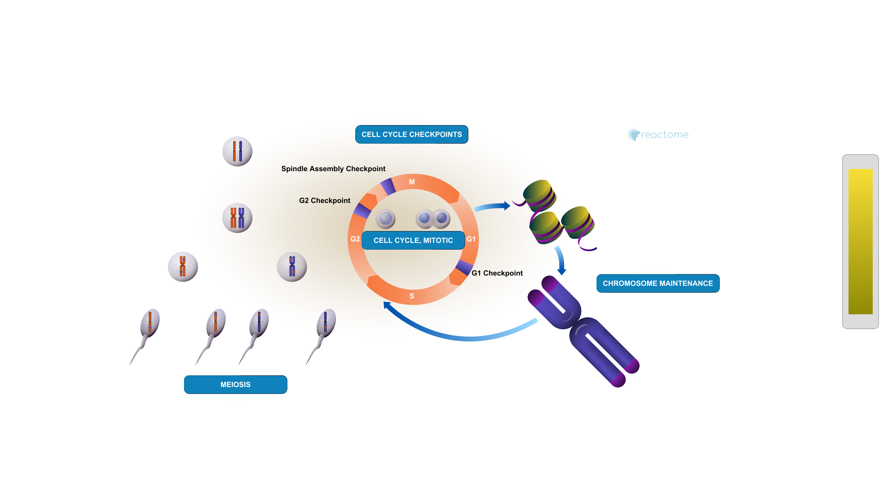

## Background 

Pathway analysis (also known as gene set analysis or over-representation analysis), aims to reduce the complexity of interpreting gene lists via mapping the listed genes to known (i.e. annotated) biological pathways, processes and functions.

## Data Import 

```{r, message=FALSE}
library(DESeq2)
```

Let's read the `count` data and `metadata` abouot this experiment setup from the supplied CSV files

```{r}
metaFile <- "GSE37704_metadata.csv"
countFile <- "GSE37704_featurecounts.csv"
```

### Sanity check 

```{r}
# Import metadata and take a peek
colData = read.csv(metaFile, row.names=1)
head(colData)
```

```{r}
# Import countdata and take a look
countData = read.csv(countFile, row.names=1)
head(countData)
```

> **Q**. Complete the code below to remove the troublesome first column from countData

```{r}
# We need to remove the odd first $length col
countData <- as.matrix(countData[,-1])
head(countData)
```

```{r}
colnames(countData)
```


```{r}
all(colnames(countData)==colData$id)
```

> Q. Complete the code below to filter countData to exclude genes (i.e. rows) where we have 0 read count across all samples (i.e. columns).

```{r}
# Filter count data where you have 0 read count across all samples.
countData = countData[rowSums(countData) > 0, ]
head(countData)
```

## Setup DESeq object

```{r}
# Setup the DESeqDataSet object required for the DESeq() function 
dds = DESeqDataSetFromMatrix(countData=countData,
                             colData=colData,
                             design=~condition)
```

## Run DESeq analysis pipeline

```{r}
# Run the DESeq pipeline

dds = DESeq(dds)
dds
```

## Extract the results 

```{r}
# Get results for the HoxA1 knockdown versus control siRNA
res = results(dds)
```

> **Q**. Call the summary() function on your results to get a sense of how many genes are up or down-regulated at the default 0.1 p-value cutoff.

```{r}
summary(res)
```

```{r}
head(res)
```

## Data viz
Volcano Plot 

```{r}
library(ggplot2)

ggplot(res) + 
  aes(log2FoldChange, -log(padj)) +
  geom_point()
```

> **Q**. Improve this plot by completing the below code, which adds color, axis labels and cutoff lines:

```{r}
# Make a color vector for all genes
mycols <- rep("gray", nrow(res))

# Color blue the genes with fold change above 2
mycols[ abs(res$log2FoldChange) > 2 ] <- "blue"

# Color gray those with adjusted p-value more than 0.01
mycols[ res$padj > 0.01 ] <- "gray"
```

```{r}
ggplot(res) + 
  aes(log2FoldChange, -log(padj)) +
  geom_point(col=mycols) + 
  geom_vline(xintercept=c(-2,+2), col="red") +
  geom_hline(yintercept = -log(0.05), col="red")
```

## Add Annotation Data

> Q. Use the mapIDs() function multiple times to add SYMBOL, ENTREZID and GENENAME annotation to our results by completing the code below.

```{r}
# Load packages
library("AnnotationDbi")
library("org.Hs.eg.db")

columns(org.Hs.eg.db)

# Add symbol annotation
res$symbol = mapIds(org.Hs.eg.db,
                    keys=row.names(res), 
                    keytype="ENSEMBL",
                    column="SYMBOL",
                    multiVals="first")

# Add entrezid annotation
res$entrez = mapIds(org.Hs.eg.db,
                    keys=row.names(res),
                    keytype="ENSEMBL",
                    column="ENTREZID",
                    multiVals="first")

# Add genename annotation
res$name =   mapIds(org.Hs.eg.db,
                    keys=row.names(res),
                    keytype="ENSEMBL",
                    column="GENENAME",
                    multiVals="first")

head(res, 10)
```

> Q. Finally for this section let's reorder these results by adjusted p-value and save them to a CSV file in your current project directory.

```{r}
# reorder these results by adjusted p-value and save them to a CSV file
res = res[order(res$pvalue), ]
write.csv(res, file = "deseq_results.csv")
```

## Pathway Analysis 

Now we can load the packages and setup the KEGG data-sets we need

KEGG, GO, and REACTOME

```{r}
# Run in your R console (i.e. not your Rmarkdown doc!)
#BiocManager::install( c("pathview", "gage", "gageData") )

# For old versions of R only (R < 3.5.0)!
#source("http://bioconductor.org/biocLite.R")
#biocLite( c("pathview", "gage", "gageData") )
```

```{r}
library(pathview)
library(gage)
library(gageData)

data(kegg.sets.hs)
data(sigmet.idx.hs)

# Focus on signaling and metabolic pathways only
kegg.sets.hs = kegg.sets.hs[sigmet.idx.hs]

# Examine the first 3 pathways
head(kegg.sets.hs, 3)
```

```{r}
foldchanges = res$log2FoldChange
names(foldchanges) = res$entrez
head(foldchanges)
```

Now, let’s run the gage pathway analysis.

```{r}
# Get the results
keggres = gage(foldchanges, gsets=kegg.sets.hs)
```

Now lets look at the object returned from `gage()`.

```{r}
attributes(keggres)
```

```{r}
# Look at the first few down (less) pathways
head(keggres$less)
```

```{r}
pathview(gene.data=foldchanges, pathway.id="hsa04110")
```


```{r}
# A different PDF based output of the same data
pathview(gene.data=foldchanges, pathway.id="hsa04110", kegg.native=FALSE)
```


Now, let's process our results a bit more to automagicaly pull out the top 5 upregulated pathways, then further process that just to get the pathway IDs needed by the pathview() function. We'll use these KEGG pathway IDs for pathview plotting below.

```{r}
## Focus on top 5 upregulated pathways here for demo purposes only
keggrespathways <- rownames(keggres$greater)[1:5]

# Extract the 8 character long IDs part of each string
keggresids = substr(keggrespathways, start=1, stop=8)
keggresids
```

lets pass these IDs in keggresids to the pathview() function to draw plots for all the top 5 pathways.

```{r}
pathview(gene.data=foldchanges, pathway.id=keggresids, species="hsa")
```


> Q. Can you do the same procedure as above to plot the pathview figures for the top 5 down-regulated pathways?

```{r}
## Focus on top 5 drownregulated pathways here for demo purposes only
keggrespathways.down <- rownames(keggres$less)[1:5]

# Extract the 8 character long IDs part of each string
keggresids.down = substr(keggrespathways.down, start=1, stop=8)
keggresids.down

# Plot pathview figures for top 5 downregulated pathways
pathview(gene.data=foldchanges, pathway.id=keggresids.down, species="hsa")
```


## Gene Ontology 

```{r}
data(go.sets.hs)
data(go.subs.hs)

# Focus on Biological Process subset of GO
gobpsets = go.sets.hs[go.subs.hs$BP]

gobpres = gage(foldchanges, gsets=gobpsets)

lapply(gobpres, head)
```

## Reactome 

```{r}
sig_genes <- res[res$padj <= 0.05 & !is.na(res$padj), "symbol"]
print(paste("Total number of significant genes:", length(sig_genes)))
```

```{r}
write.table(sig_genes, file="significant_genes.txt", row.names=FALSE, col.names=FALSE, quote=FALSE)
```



> Q. What pathway has the most significant “Entities p-value”? Do the most significant pathways listed match your previous KEGG results? What factors could cause differences between the two methods?

The pathway that has the most significant “Entities p-value” is the Cell Cycle. KEGG and reactome analysis show that the cell cycle is the most significantly downregulated and upregulated pathway, confirming this. However, the factors that could cause the differences between the two methods could be caused due to the differing contents of each database and their methods of generating pathways independently. These databases use different algorithims and calculate significance in different ways. This is why using different tools is important for complete and accurate analysis.

## Save our results

```{r}
write.csv(res, file="myresults_annotated.csv")
```

